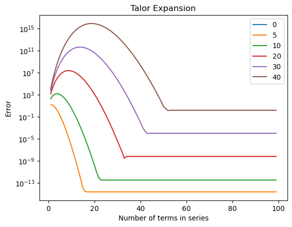
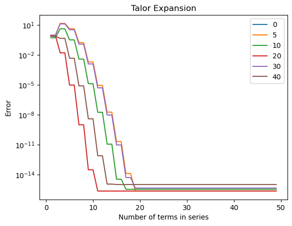

# 计算物理第三次作业

> 2020302191422 祝茗

## 公式

### $\sin(x)$的泰勒级数

$$
\sin(x) = x - \frac{x^3}{3!} + \frac{x^5}{5!} - \frac{x^7}{7!} + \cdots + (-1)^{n-1} \frac{x^{2n-1}}{(2n-1)!} + \cdots
$$

### $\sin(x)$的有限项近似（在第$n$项截断）

$$
\begin{split}
\sin(x) &\approx x - \frac{x^3}{3!} + \frac{x^5}{5!} - \frac{x^7}{7!} + \cdots + (-1)^{n-1} \frac{x^{2n-1}}{(2n-1)!} \\
      &= \displaystyle\sum\limits_{n=1}^{N} \frac{(-1)^{n-1}x^{2n-1}}{(2n-1)!}
\end{split}
$$

### $\sin(x)$的有限项近似（两项两项组合计算）

$$
\sin(x) \approx \left(x - \frac{x^3}{3!}\right) + \left(\frac{x^5}{5!} - \frac{x^7}{7!}\right) + \cdots \\
$$

### $\sin(x)$性质

$$
\sin(x) = \sin(x + 2n\pi)
$$

## 编写函数利用有限级数计算$\sin(x)$

```python
def my_first_sin(x: float, n=100):
    '''
    取sin(x)的泰勒级数的前n项
    默认 n=100
    '''
    res = 0
    item = x
    for i in range(n+1):
        res += item
        item = item * (-1) * x * x / (2*i+2) / (2*i+3)
    return res
```

## 编写函数确定截止项，要求截止项不大于此项之前各项之和的$10^{-7}$

$$
\frac{\left|(-1)^{N} x^{2N+1}\right|}{(2N-1) !} \le 10^{-7}\left|\sum_{n=1}^{N} \frac{(-1)^{n-1} x^{2 n-1}}{(2 n-1) !}\right|
$$

```python
def my_second_sin(x: float):
    '''
    sin(x)的泰勒级数展开
    直到某一项的绝对值小于前n项和的绝对值的 10^(-7)
    '''
    res = 0
    n = 1
    item = x
    while (abs(item) > 10**(-7) * abs(res)):
        res += item
        n += 1
        item = item * (-1) * x * x / (2*n-1) / (2*n-2)
    return res
```

## 编写函数计算级数和与真值math.sin(x)的差异

```python
import math


def diff(a, b, mode="absolute"):
    '''
    计算绝对误差或相对误差
    '''
    if mode == "absolute":
        return abs(a-b)
    elif mode == "relative":
        return abs((a-b)/b)
    else:
        exit(0)


x = math.pi * 10 - 0.00001
n = 100


print('               x = %23.20f' % x)
print('     math.sin(x) = %23.20f' % math.sin(x))
print(' my_first_sin(x) = %23.20f, error = %23.20f' % (my_first_sin(x, n), diff(my_first_sin(x), math.sin(x))))
print(' my_forth_sin(x) = %23.20f, error = %23.20f' % (my_forth_sin(x), diff(my_forth_sin(x), math.sin(x))))
```

output:

```txt
               x = 31.41591653589793153856
     math.sin(x) = -0.00001000000000067940
 my_first_sin(x) =  0.00026469823623408579, error =  0.00027469823623476518
my_second_sin(x) =  0.00002731828858631688, error =  0.00003731828858699628
```

## 编写函数绘制差异随截止项和$x$变化

```python
import matplotlib.pyplot as plt
import numpy as np


fig = plt.figure()
plt.title("Talor expansion")
plt.xlabel("Number of terms in series")
plt.ylabel("Error")
plt.yscale("log") # 设置y轴为对数坐标


num_of_terms = np.arange(1, 100)
test_x = [0, 5, 10, 20, 30, 40]


for x in test_x:
    error = [diff(my_first_sin(x, n), math.sin(x)) for n in num_of_terms]
    plt.plot(num_of_terms, error)


plt.legend(labels=['2*pi', '5*pi', '10*pi', '15*pi', '20*pi'], loc='best')


plt.show()
```



> 可以看出，对于按项数截止的$\sin(x)$函数，其绝对误差的大小在某一展开项之后就不在变化
>
> 对于绝对值较大的x，其计算的误差较大

## 尝试不同的计算方法改进计算精度（开放讨论）

```python
def my_third_sin(x: float):
    '''
    sin(x)的泰勒级数展开 两项组合计算
    直到 某一组合项的绝对值 小于 前n项和的绝对值的 10^(-7)
    '''
    res = 0
    n = 2
    item_1 = x
    item_2 = (-1) * x * x * x / 2 / 3
    while True:
        combination_item = item_1 + item_2
        if (abs(combination_item) < 10**(-7) * abs(res)):
            break
        res += combination_item
        n += 1
        item_1 = item_2 * (-1) * x * x / (2*n-1) / (2*n-2)
        n += 1
        item_2 = item_1 * (-1) * x * x / (2*n-1) / (2*n-2)
    return res
```

```python
def my_forth_sin(x: float, num=100):
    '''
    考虑x较大时的误差 缩小x的范围
    sin(x)的泰勒级数展开两项 组合计算
    直到 某一组合项的绝对值 小于前n项和的绝对值的 10^(-7)
    '''
    x = x % (2*math.pi)  # 缩小abs(x)到0附近

    res = 0
    n = 2
    item_1 = x
    item_2 = (-1) * x * x * x / 2 / 3
    while (n < num):
        combination_item = item_1 + item_2
        if (abs(combination_item) < 10**(-7) * abs(res)):
            break
        res += combination_item
        n += 1
        item_1 = item_2 * (-1) * x * x / (2*n-1) / (2*n-2)
        n += 1
        item_2 = item_1 * (-1) * x * x / (2*n-1) / (2*n-2)
    return res
```



> 可以较快的收敛
>
> 与math.sin(x)相比，基本可以保持十四位小数的精度
