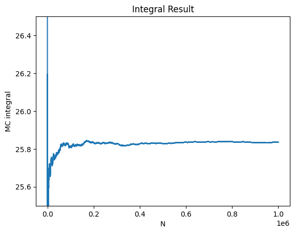
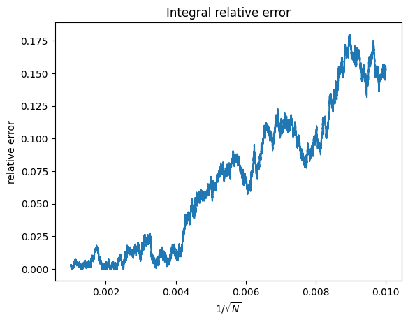

# 计算物理第六次作业

> 2020302191422 祝茗

## 5.17.2 (3)

> Plot the relative error vs. $1∕\sqrt{N}$ and see if linear behavior occurs.
>
> 绘制10维蒙卡积分的误差随撒点数的关系

根据数学计算可知，10维的积分的解析解为

$$
I = \int_0^1 \mathrm{d}x_1 \int_0^1 \mathrm{d}x_2 \cdots \int_0^1 \mathrm{d}x_{10} = \frac{155}{6}
$$

运用蒙特卡洛方法计算积分的数值解，并计算与解析解之间的误差。

计算结果保存为两个数组。

```python
import numpy as np
import matplotlib.pyplot as plt


def integrand(xdata: np.array) -> float:
    return sum(xdata) ** 2


# Monte Carlo Integration
def MCIntegrate(f, N: int):
    '''
    f: function to integrate -- integrand
    n: number of dimensions
    N: number of samples
    returns: integral result and integral error    
    '''
    sum = 0.0
    res = []
    relativeError = []
    for i in range(1, N+1):
        sum += f(np.random.rand(10))
        res.append(sum/i)
        relativeError.append(abs(res[-1] - 155/6))
    return res, relativeError
```

计算蒙卡积分的误差与$\frac{1}{\sqrt{N}}$之间的关系

```python
N = 1000000
Nlist = range(1, N+1)
res, relativeError = MCIntegrate(integrand, N)

fig = plt.figure()
plt.title("Integral Result")
plt.xlabel('N')
plt.ylabel('MC integral')
plt.ylim(25.5, 26.5)
plt.plot(Nlist, res)

fig = plt.figure()
plt.title("Integral relative error")
plt.plot([1/np.sqrt(N) for N in Nlist][10000:-1], relativeError[10000:-1])
plt.xlabel('$1/\sqrt{N}$')
plt.ylabel('relative error')

plt.show()
```



蒙卡积分确实可以收敛到真值附近。



可以看出，蒙卡积分的误差，大致与$1\sqrt{N}$成正比。

## 修改Listing 6.1代码中计算导数的部分为`autograd`，并求解该静力学平衡问题

在书本代码的基础之上进行了大量的修改，增加了大量注释。并且决定舍弃了vpython部分代码，理由如下

- vpython并不影响最终的求解
- vpython的结果不能在vscode中显示（目前没有找到较好的解决方式）
- vpython大幅度拖慢了运行速度（4s --> 11min）

```python
import autograd.numpy as np
import autograd as ag
# from vpython import *


# scene = canvas(title="Strings and masses configuration", width=500, height=500)
# tempe = curve(x=range(0, 500), color=color.black)

n = 9       # number of equations
eps = 1e-7  # tolerance

deriv = np.zeros((n, n), float)
f = np.zeros((n), float)
x = np.array([0.5, 0.5, 0.5, 0.5, 0.5, 0.5, 1.0, 1.0, 1.0])


def plotconfig():
    # for obj in scene.objects:  # to erase the previous configuration
    #     obj.visible = 0

    L1 = 3.0
    L2 = 4.0
    L3 = 4.0

    xa = L1 * x[3]          # L1*cos(th1)
    ya = L1 * x[0]          # L1*sin(th1)
    xb = xa + L2 * x[4]     # L1*cos(th1) + L2*cos(th2)
    yb = ya + L2 * x[1]     # L1*sin(th1) + L2*sen(th2)
    xc = xb + L3 * x[5]     # L1*cos(th1) + L2*cos(th2) + L3*cos(th3)
    yc = yb - L3 * x[2]     # L1*sin(th1) + L2*sen(th2) - L3*sin(th3)

    mx = 100.0              # for linear coordinate transformation
    bx = -500.0             # from     0 <=      x       <= 10
    my = -100.0             # to    -500 <=   x_window   <= 500
    by = 400.0              # same transformation for y

    xap = mx * xa + bx      # to keep aspect ratio
    yap = my * ya + by

    xbp = mx * xb + bx
    ybp = my * yb + by

    xcp = mx * xc + bx
    ycp = my*yc + by
    x0 = mx*0 + bx
    y0 = my*0 + by

    # ball1 = sphere(pos=vector(xap, yap, 0), color=color.cyan, radius=15)
    # ball2 = sphere(pos=vector(xbp, ybp, 0), color=color.cyan, radius=25)
    # line1 = curve(pos=[(x0, y0, 0), (xap, yap, 0)], color=color.yellow, radius=4)
    # line2 = curve(pos=[(xap, yap, 0), (xbp, ybp, 0)], color=color.yellow, radius=4)
    # line3 = curve(pos=[(xbp, ybp, 0), (xcp, ycp, 0)], color=color.yellow, radius=4)
    # topline = curve(pos=[(x0, y0, 0), (xcp, ycp, 0)], color=color.red, radius=4)


def F(x: np.array) -> np.array:
    '''
    Define F function
    '''
    f[0] = 3*x[3] + 4*x[4] + 4*x[5] - 8.0
    f[1] = 3*x[0] + 4*x[1] - 4*x[2]
    f[2] = x[6]*x[0] - x[7]*x[1] - 10.0
    f[3] = x[6]*x[3] - x[7]*x[4]
    f[4] = x[7]*x[1] + x[8]*x[2] - 20.0
    f[5] = x[7]*x[4] - x[8]*x[5]
    f[6] = np.power(x[0], 2) + np.power(x[3], 2) - 1.0
    f[7] = np.power(x[1], 2) + np.power(x[4], 2) - 1.0
    f[8] = np.power(x[2], 2) + np.power(x[5], 2) - 1.0
    return f

############################################# Newton-Raphson method ##################################################


def dFi_dXj(x, deriv, n):
    h = 1e-4                    # step size

    for j in range(n):
        temp = x[j]             # store the original value of x[j]
        x[j] = x[j] + h/2.0
        f = F(x)                # compute f(x+h/2)
        for i in range(n):
            deriv[i, j] = f[i]  # store f[i] when x[j] is slightly perturbed
        x[j] = temp             # restore the original value of x[j]

    for j in range(n):
        temp = x[j]                             # store the original value of x[j]
        x[j] = x[j] - h/2.0
        f = F(x)                                # compute f(x-h/2)
        for i in range(n):
            deriv[i, j] = (deriv[i, j]-f[i])/h  # compute the derivative of f[i] with respect to x[j]: (f(x+h/2)-f(x-h/2))/h
        x[j] = temp                             # restore the original value of x[j]


############################################# Newton-Raphson method ##################################################


###################################################### autograd ######################################################


def f1(x: np.array) -> np.array:
    return np.array([3*x[3] + 4*x[4] + 4*x[5] - 8.0])


def f2(x: np.array) -> np.array:
    return np.array([3*x[0] + 4*x[1] - 4*x[2]])


def f3(x: np.array) -> np.array:
    return np.array([x[6]*x[0] - x[7]*x[1] - 10.0])


def f4(x: np.array) -> np.array:
    return np.array([x[6]*x[3] - x[7]*x[4]])


def f5(x: np.array) -> np.array:
    return np.array([x[7]*x[1] + x[8]*x[2] - 20.0])


def f6(x: np.array) -> np.array:
    return np.array([x[7]*x[4] - x[8]*x[5]])


def f7(x: np.array) -> np.array:
    return np.array([np.power(x[0], 2) + np.power(x[3], 2) - 1.0])


def f8(x: np.array) -> np.array:
    return np.array([np.power(x[1], 2) + np.power(x[4], 2) - 1.0])


def f9(x: np.array) -> np.array:
    return np.array([np.power(x[2], 2) + np.power(x[5], 2) - 1.0])


Func_f = [f1, f2, f3, f4, f5, f6, f7, f8, f9]


def autograd_dFi_dXj(x, deriv, n):
    '''
    use automatic differentiation to compute the derivatives
    '''
    for i in range(n):
        deriv[i, :] = ag.grad(Func_f[i])(x)


###################################################### autograd ######################################################


flag = True  # flag to indicate whether to break the loop

for it in range(1, 100):
    f = F(x)  # compute all the f(x)

    # dFi_dXj(x, deriv, n)
    autograd_dFi_dXj(x, deriv, n)

    B = - f.reshape(n, 1)               # B = - f (a colume vector)
    sol = np.linalg.solve(deriv, B)     # solve
    dx = sol[:, 0]                      # take the first column of matrix sol

    for i in range(n):
        x[i] = x[i] + dx[i]
    # plotconfig()
    errX = errF = errXi = 0.0

    for i in range(n):
        if (x[i] != 0.):                        # to avoid division by zero
            errXi = abs(dx[i]/x[i])             # relative error in x[i]
        else:
            errXi = abs(dx[i])                  # absolute error in x[i]

        if (errXi > errX):
            errX = errXi                        # find the maximum relative error in x[i]

        if (abs(f[i]) > errF):
            errF = abs(f[i])                    # find the maximum absolute value of f[i]

        if ((errX <= eps) and (errF <= eps)):   # if both errX and errF are small enough, then stop
            flag = False

    if (flag == False):
        break


print('Number of iterations = ', it)
print('Solution:')

for i in range(n):
    print('x[%d] = %23.20f' % (i, x[i]))
```

代码中用`autograd`不知道怎么把`f[i]`写到一起，就写了一个包含了九个`f[i]`的list。

---

设置`eps`为$10^{-3}$时，运行的结果为

```text
Number of iterations =  7
Solution:
x[0] =  0.76100247210685356691
x[1] =  0.26495443300889026661
x[2] =  0.83570628708903049731
x[3] =  0.64874962453391893380
x[4] =  0.96426097706024360701
x[5] =  0.54917680453931694284
x[6] = 17.16018802106874119318
x[7] = 11.54526089317382009369
x[8] = 20.27150783763694974482
```

设置`eps`为$10^{-6}$时，运行的结果为

```text
Number of iterations =  8
Solution:
x[0] =  0.76100269210320237168
x[1] =  0.26495381027986020239
x[2] =  0.83570582935726189788
x[3] =  0.64874872070204792074
x[4] =  0.96426110489772842715
x[5] =  0.54917735457573546576
x[6] = 17.16020978458048062976
x[7] = 11.54527968431141893291
x[8] = 20.27152804462708957089
```

设置`eps`为$10^{-7}$时，运行的结果为

```text
Number of iterations =  9
Solution:
x[0] =  0.76100269210187165836
x[1] =  0.26495381028070258411
x[2] =  0.83570582935710635564
x[3] =  0.64874872070294220538
x[4] =  0.96426110489728744657
x[5] =  0.54917735457550598266
x[6] = 17.16020978460728940718
x[7] = 11.54527968432775786312
x[8] = 20.27152804463911905941
```

设置`eps`为$10^{-12}$时，运行的结果为

```text
Number of iterations =  10
Solution:
x[0] =  0.76100269210187154734
x[1] =  0.26495381028070269513
x[2] =  0.83570582935710624461
x[3] =  0.64874872070294209436
x[4] =  0.96426110489728744657
x[5] =  0.54917735457550609368
x[6] = 17.16020978460729295989
x[7] = 11.54527968432775963947
x[8] = 20.27152804463911905941
```

设置`eps`为$10^{-16}$时，运行的结果为

```text
Number of iterations =  11
Solution:
x[0] =  0.76100269210187154734
x[1] =  0.26495381028070258411
x[2] =  0.83570582935710635564
x[3] =  0.64874872070294220538
x[4] =  0.96426110489728733555
x[5] =  0.54917735457550609368
x[6] = 17.16020978460729295989
x[7] = 11.54527968432775963947
x[8] = 20.27152804463911550670
```

> 计算精度：那就到此为止吧，再高就不礼貌了。

## 额外内容之pygame

去简单游玩了一下，推荐个还算有意思的推箱子游戏。

[https://www.pygame.org/project/5617/8144](https://www.pygame.org/project/5617/8144)
