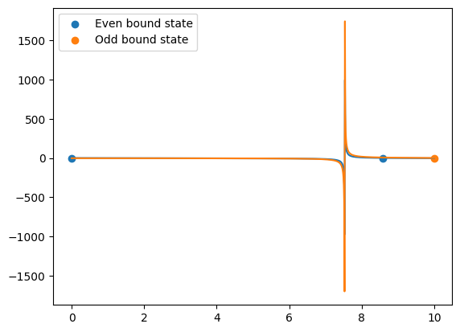
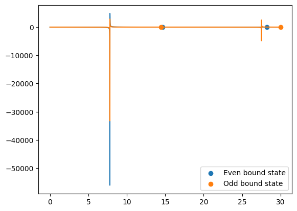
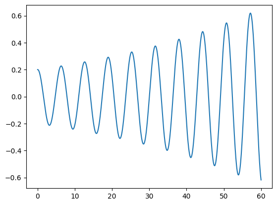
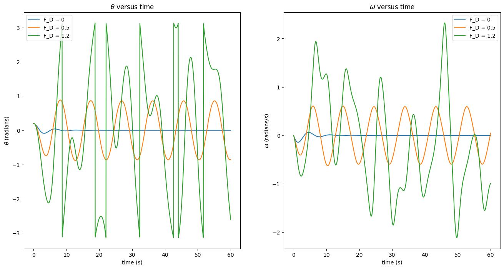
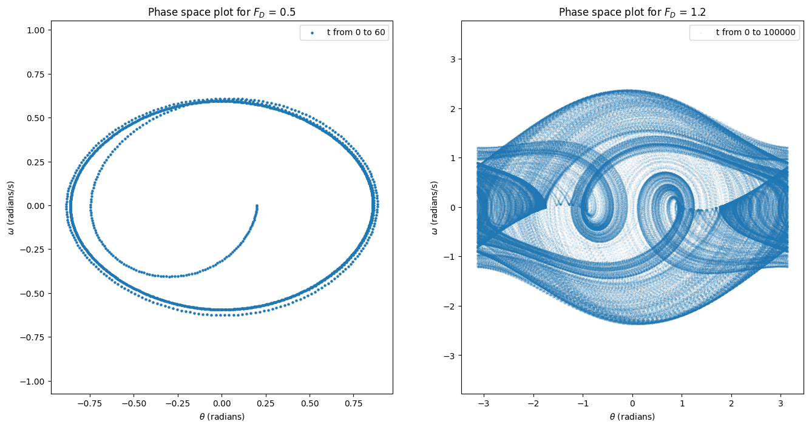

# 计算物理第七次作业

> 2020302191422 祝茗

## 利用公式(7.2)和(7.3)计算有限深方势阱的能级，最好能够复现量子力学课本上的计算结果，即不同参数条件下都能把能级找到

The energies of the bound states $E=-E_B < 0$ within this well are solutions of the transcendental equations.

$$
V(x) =
\left\{
\begin{aligned}
-V_0, & & -a \le x \le a \\
0, & & |x|>a
\end{aligned}
\right.
$$

### 束缚态解

**在$x<-a$区域**，薛定谔方程可以写为

$$
\frac{\mathrm{d}^2 \psi}{\mathrm{d} x^2} = \kappa^2 \psi
$$

其中，正实数$\kappa$定义为

$$
\kappa \equiv \frac{\sqrt{-2mE}}{\hbar} > 0
$$

物理上所允许的解为

$$
\psi(x) = B e^{\kappa x}, (x < -a)
$$

**在$-a<x<a$区域**，$V(x)=-V_0$，薛定谔方程可以写为

$$
\frac{\mathrm{d}^2 \psi}{\mathrm{d} x^2} = - l^2 \psi
$$

其中，正实数$l$定义为

$$
l \equiv \frac{\sqrt{2m(E+V_0)}}{\hbar} > 0
$$

方程的一般解为$\psi(x) = C \sin(lx) + D \cos(lx)$

**在$x>a$区域**，势为零；物理上所允许的解为解为

$$
\psi(x) = F e^{-\kappa x}, (x>a)
$$

考虑**边界条件**：$\psi$和$\dfrac{\mathrm{d} \psi}{\mathrm{d}x}$在$a,-a$两处连续。由于势函数是一个偶函数，不失一般性，我们可以假设解是一个奇函数或一个偶函数。

我们所要求的的偶函数解为

$$
\psi =
\left\{
\begin{aligned}
F e^{-\kappa x}, & & x>a \\
D \cos(lx), & & 0<x<a \\
\psi(-x), & & x<0
\end{aligned}
\right.
$$

由波函数$\psi(x)$在$x=a$处的连续性可得

$$
F e^{-\kappa x} = D \cos(la)
$$

由$\dfrac{\mathrm{d} \psi}{\mathrm{d} x}$连续性可得

$$
-\kappa F e^{- \kappa x} = -l D \sin(la)
$$

两式相除，可得

$$
\kappa = l \tan(la)
$$

由千$\kappa$和$l$都是$E$的函数，这个公式可以求出所允许的能量。

按照书上的说法，令$\hbar=1, 2m=1, a=1, V_0=10, E=-E_B(E_B>0)$，可得方程

$$
\sqrt{10-E_B} \tan \left(\sqrt{10-E_B}\right) = \sqrt{E_B} (even)
$$

同理可得奇束缚态的解

$$
\sqrt{10-E_B} \cot \left(\sqrt{10-E_B}\right) = \sqrt{E_B} (odd)
$$

公式推导，到此为止。

---

先写出奇偶束缚态的函数表达式

```python
def evenBoundState(x):
    return np.sqrt(VE-x) * np.tan(np.sqrt(VE-x)) - np.sqrt(x)


def oddBoundState(x):
    return np.tan(np.sqrt(VE-x)) * np.sqrt(x) - np.sqrt(VE-x)
```

使用`二分法`求函数零点

```python
def bisection(f, xminus, xplus, Nmax, eps):  # x+, x-, Nmax, error
    for it in range(Nmax):
        xmid = (xplus + xminus) / 2.0   # Mid point
        if (f(xplus) * f(xmid) > 0.):   # Root in left half
            xplus = xmid                # Change x+ to x
        else:                           # Root in left half
            xminus = xmid               # Change x- to x
        if (abs(f(xmid)) < eps):
            # print("\n Root found with precision eps = ", eps)
            return xmid
        if it == Nmax-1:
            # print("\n Root NOT found after Nmax iterations\n")
            return -1
```

预计在正负无穷大的分界点，无法用二分法求出函数零点。在最大迭代次数后返回`-1`，作为提示。

求零点并绘图的函数

```python
def findZerosAndPlotCurves(f, ve: float, n: int) -> list:
    X = np.linspace(0, ve, n)
    Y = f(X)
    plt.plot(X, Y)

    xZeros = []

    for i in range(0, n-1):
        if f(X[i]) * f(X[i+1]) > 0:
            continue
        else:
            theZero = bisection(f, X[i], X[i+1], imax, eps)
            if theZero != -1:
                xZeros.append(theZero)

    return xZeros
```

欲求的零点以数组的形式作为函数的返回值。

分别求出有限深势阱对应的奇偶束缚态

```python
VE = 10  # Energy
N = 100*VE
eps = 1e-6  # Precision of zero
imax = 100  # Max iterations

fig = plt.figure()

evenStateZeros = findZerosAndPlotCurves(evenBoundState, VE, N)
oddStateZeros = findZerosAndPlotCurves(oddBoundState, VE, N)

plt.scatter(evenStateZeros, np.zeros(len(evenStateZeros)), label="Even bound state")
plt.scatter(oddStateZeros, np.zeros(len(oddStateZeros)), label="Odd bound state")

plt.legend(loc='best')
plt.show()

print("Find ", len(evenStateZeros), " Even bound state zero(s): ", evenStateZeros)
print("Find ", len(oddStateZeros), " Odd bound state zero(s): ", oddStateZeros)
```

$V_E = 10$时，有



```text
Find  2  Even bound state zero(s):  [0.004019216970877127, 8.592785290172985]
Find  1  Odd bound state zero(s):  [9.999999999999854]
```

$V_E = 30$时，有



```text
Find  2  Even bound state zero(s):  [14.66605323519298, 28.241113533612765]
Find  2  Odd bound state zero(s):  [14.428806184092611, 29.999999999999964]
```

$V_E = 50$时，有


```text
Find  3  Even bound state zero(s):  [5.965365436368524, 33.23279279879414, 48.10914621278748]
Find  2  Odd bound state zero(s):  [36.37854890314, 49.999999999999986]
```

经过简单的检验，确实可以实现在不同的参数条件下，找到各个奇偶束缚态的解。

## 按照Nicholas J. Giordano和Hisao Nakanishi书上公式(3.19)复现图3.6，并绘制图3.8

使用 Euler Cromer 方法计算单摆的运动

```python
def euler_cromer_calculate(theta0, omega0, t0, tf, dt):
    """
    :param theta0: initial angle
    :param omega0: initial angular velocity
    :param t0: initial time
    :param tf: final time
    :param dt: time step
    :return: theta, omega, t
    """
    N = int((tf - t0) / dt) + 1
    t = np.linspace(t0, tf, N)
    theta = np.zeros(N)
    omega = np.zeros(N)
    theta[0] = theta0
    omega[0] = omega0

    for i in range(N-1):
        omega[i+1] = omega[i] - (g/l*np.sin(theta[i]) + q*omega[i] + F_D*np.sin(Omega_D*t[i])) * dt
        # theta[i+1] = (theta[i] + omega[i] * dt + np.pi) % (2 * np.pi) - np.pi  # wrong method
        # theta[i+1] = theta[i] + omega[i+1] * dt
        theta[i+1] = (theta[i] + omega[i+1] * dt + np.pi) % (2 * np.pi) - np.pi  # (theta+pi) % (2*pi) - pi, keeps theta in [-pi, pi]

    return t, theta, omega
```

使用错误的方法计算的结果：



可见，如果迭代的方法出错，会使得结果发散。

改正迭代的方法后，画出不同驱动力下`theta-t`和`omega-t`的曲线图，复现了课本上的的结果。（chaos的情形与课本略有区别）



使用`matplotlib.animation.Funcanimation`绘制`gif`动图

```python
fig = plt.figure()
ax = plt.axes(xlim=(-1.1*l, 1.1*l), ylim=(-1.1*l, 1.1*l))
ax.axis('equal')
line, = ax.plot([], [], lw=2)


def init():
    line.set_data([], [])
    return line,


def update(i):
    x = np.sin(theta[i]) * l        # x = l*sin(theta)
    y = -np.cos(theta[i]) * l       # y = -l*cos(theta)
    line.set_data([0, x], [0, y])   # update the line
    return line,


anim = animation.FuncAnimation(fig=fig, func=update, frames=len(t), init_func=init, interval=200, blit=True)
anim.save('double_pendulum.gif', writer='pillow', fps=30)
plt.show()
```


绘制`theta-omega`图，复现书上的图3.8

```python
fig, [ax1, ax2] = plt.subplots(1, 2, figsize=(16, 8))
ax1.axis('equal')
ax2.axis('equal')

t0 = 0
tf = 60
F_D = 0.5

t, theta, omega = euler_cromer_calculate(theta0, omega0, t0, tf, dt)

ax1.scatter(theta, omega, s=5, label="t from 0 to 60")
ax1.set_title("Phase space plot for $F_D$ = 0.5")
ax1.set_xlabel("$\\theta$ (radians)")
ax1.set_ylabel("$\omega$ (radians/s)")
ax1.legend(loc='best')

t0 = 0
tf = 10000
F_D = 1.2

t, theta, omega = euler_cromer_calculate(theta0, omega0, t0, tf, dt)

ax2.scatter(theta, omega, s=0.01, label="t from 0 to 100000")
ax2.set_title("Phase space plot for $F_D$ = 1.2")
ax2.set_xlabel("$\\theta$ (radians)")
ax2.set_ylabel("$\omega$ (radians/s)")
ax2.legend(loc='best')

plt.show()
```

对于较为有规律的情形，画了60s；对于chaos的情形，画了10000s



混沌而美丽。
