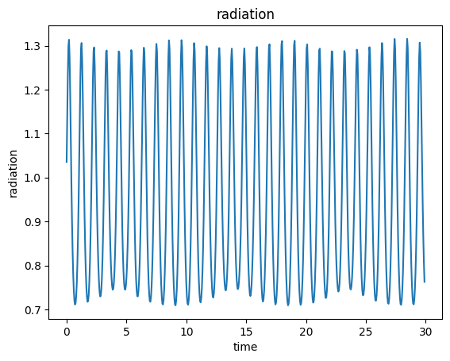

# 计算物理第八次作业

> 2020302191422 祝茗

## 将木星也视作另一个太阳，计算地球所受的辐照强度，换算成温度，体会一下三体星人的痛苦（不考虑地球本身的自转，只计算地球所受辐射的平均值）

基本按照书本上的计算过程，编写了限制性的（一静止，两个运动）二维三体模拟程序。

### 初始化参数设置

查阅相关资料后，设置了太阳，地球，木星各自的质量、初始位置与初始速度。

```python
import numpy as np
import matplotlib.pyplot as plt
from matplotlib.animation import FuncAnimation


# time
t = 50  # end time
dt = 0.005  # year
time = np.arange(0, t, dt)

# list of conditions
x_e = np.zeros(len(time))       # x position of earth
y_e = np.zeros(len(time))       # y position of earth
vx_e = np.zeros(len(time))      # x velocity of earth
vy_e = np.zeros(len(time))      # y velocity of earth

x_j = np.zeros(len(time))       # x position of jupiter
y_j = np.zeros(len(time))       # y position of jupiter
vx_j = np.zeros(len(time))      # x velocity of jupiter
vy_j = np.zeros(len(time))      # y velocity of jupiter

# init parameters
M_S = 2.0e30  # mass of sun
M_E = 6.0e24  # mass of earth
M_J = 1.9e27  # mass of jupiter

x_e[0] = 1                  # initial position of earth
y_e[0] = 0                  # initial position of earth

vx_e[0] = 0         # initial velocity of earth
vy_e[0] = 2*np.pi   # initial velocity of earth

x_j[0] = 0                          # initial position of jupiter
y_j[0] = 5.2                        # initial position of jupiter
vx_j[0] = -2*np.pi / np.sqrt(5.2)   # initial velocity of jupiter
vy_j[0] = 0                         # initial velocity of jupiter

r_e = np.zeros(len(time)-1)   # distance between earth and sun
r_j = np.zeros(len(time)-1)   # distance between jupiter and sun
r_EJ = np.zeros(len(time)-1)  # distance between earth and jupiter
```

### 主要的计算程序

```python
def calculate(x_e, y_e, vx_e, vy_e, x_j, y_j, vx_j, vy_j):
    for i in range(len(time)-1):
        r_e[i] = np.sqrt(x_e[i]**2 + y_e[i]**2)                        # distance between earth and sun
        r_j[i] = np.sqrt(x_j[i]**2 + y_j[i]**2)                        # distance between jupiter and sun
        r_EJ[i] = np.sqrt((x_e[i]-x_j[i])**2 + (y_e[i]-y_j[i])**2)     # distance between earth and jupiter

        vx_e[i+1] = vx_e[i] - 4 * np.pi**2 * x_e[i] / r_e[i]**3 * dt - 4 * np.pi**2 * (M_J/M_S) * (x_e[i]-x_j[i]) / r_EJ[i]**3 * dt
        vy_e[i+1] = vy_e[i] - 4 * np.pi**2 * y_e[i] / r_e[i]**3 * dt - 4 * np.pi**2 * (M_J/M_S) * (y_e[i]-y_j[i]) / r_EJ[i]**3 * dt
        vx_j[i+1] = vx_j[i] - 4 * np.pi**2 * x_j[i] / r_j[i]**3 * dt - 4 * np.pi**2 * (M_E/M_S) * (x_j[i]-x_e[i]) / r_EJ[i]**3 * dt
        vy_j[i+1] = vy_j[i] - 4 * np.pi**2 * y_j[i] / r_j[i]**3 * dt - 4 * np.pi**2 * (M_E/M_S) * (y_j[i]-y_e[i]) / r_EJ[i]**3 * dt

        x_e[i+1] = x_e[i] + vx_e[i+1] * dt
        y_e[i+1] = y_e[i] + vy_e[i+1] * dt
        x_j[i+1] = x_j[i] + vx_j[i+1] * dt
        y_j[i+1] = y_j[i] + vy_j[i+1] * dt
```

无返回值的函数，变量直接存储在列表之中，方便后面画图。

使用`matplotlib.animation import FuncAnimation`绘制gif，展现结果。

```python
# plot the orbit
fig, ax = plt.subplots()
ax.set_xlim(-5.5, 5.5)
ax.set_ylim(-5.5, 5.5)
ax.set_aspect('equal')
ax.set_xlabel('x')
ax.set_ylabel('y')
ax.set_title('three bodies')
line1, = ax.plot([], [], 'o', color='blue')
line2, = ax.plot([], [], 'o', color='red')
line3, = ax.plot([], [], 'o', color='yellow')


def init():
    line1.set_data(x_e[0], y_e[0])
    line2.set_data(x_j[0], y_j[0])
    line3.set_data(0, 0)
    return line1, line2, line3


def animate(i):
    line1.set_data(x_e[i], y_e[i])
    line2.set_data(x_j[i], y_j[i])
    line3.set_data(0, 0)
    return line1, line2, line3


calculate(x_e, y_e, vx_e, vy_e, x_j, y_j, vx_j, vy_j)

ani = FuncAnimation(fig, animate, init_func=init, frames=len(time), interval=1, blit=True)
ani.save('three_bodies.gif', writer='pillow', fps=120)
plt.show()
```

### 计算地球所受的辐照强度

辐照强度与距离的平方成反比。

```python
def radiation(r_e, r_j, r_EJ):
    return 1/r_e**2 + 1/r_EJ**2


# plot
fig, ax = plt.subplots()
# ax.set_xlim(0, 10)
# ax.set_ylim(0, 10)
ax.set_xlabel('time')
ax.set_ylabel('radiation')
ax.set_title('radiation')

ax.plot(time[0:-1], radiation(r_e, r_j, r_EJ))
plt.show()
```


