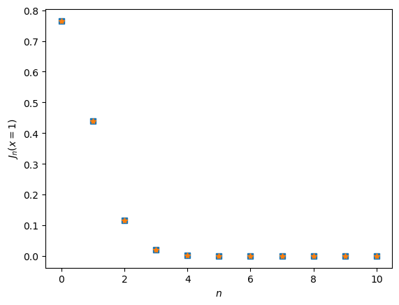
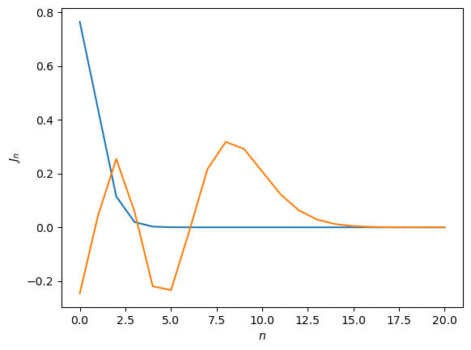

# 计算物理第一次作业

## 计算 BesselJ 函数

```python
import numpy as np
import matplotlib.pyplot as plt

epsi = 1e-9

def BesselJ(x: float, m, M) -> np.ndarray:
    """计算 Bessel 函数 J_n(x)

    Args:
        x (float): 自变量
        m (int): 最高阶数
        M (int): 返回的阶数

    Returns:
        np.ndarray: J_n(x) 的数组

    Example:
        >>> x = np.linspace(0, 20, 100)
        >>> Jn = BesselJ(x, 10, 10)
        >>> plt.plot(x, Jn.T)
        >>> plt.show()
    """
    Jn = np.zeros(m+1)
    Jn[m] = 0
    Jn[m-1] = 1
    for n in range(m-2, -1, -1):
        Jn[n] = 2*(n+1)/2 * Jn[n+1] - Jn[n+2]
        if Jn[n] > 1/epsi:  # 放缩
            Jn *= epsi
    Jn /= (Jn[0]**2 + 2*np.sum(Jn[1:]**2))**(1/2)
    return Jn[:M+1]


def BesselJ_without_rescale(x, m, M):
    """计算 Bessel 函数 J_n(x), 但不中途放缩

    Args:
        x (float): 自变量
        m (int): 最高阶数
        M (int): 返回的阶数

    Returns:
        np.ndarray: J_n(x) 的数组

    Example:
        >>> x = np.linspace(0, 20, 100)
        >>> Jn = BesselJ_without_rescale(x, 10, 10)
        >>> plt.plot(x, Jn.T)
        >>> plt.show()
    """
    Jn = np.zeros(m+1)
    Jn[m] = 0
    Jn[m-1] = 1
    for n in range(m-2, -1, -1):
        Jn[n] = 2*(n+1)/2 * Jn[n+1] - Jn[n+2]
        # 不放缩
        # if Jn[n] > 1/epsi:
        #     Jn *= epsi
    Jn /= (Jn[0]**2 + 2*np.sum(Jn[1:]**2))**(1/2)
    return Jn[:M+1]
```

当 $m$ 取比较小的时候, 两个函数得到的结果没有区别

```python
J1 = BesselJ(x=1, m=20, M=10)
J2 = BesselJ_without_rescale(x=1, m=20, M=10)
plt.plot(J1, 's')
plt.plot(J2, '*')
plt.xlabel(f'$n$')
plt.ylabel(f'$J_n(x=1)$')
```



但当 $m$ 较大, 不放缩在求和时会溢出:

```text
/tmp/ipykernel_1884776/2230336702.py:29: RuntimeWarning: overflow encountered in scalar power
Jn /= (Jn[0]**2 + 2*np.sum(Jn[1:]**2))**(1/2)
```

设置 $m=100$

```python
J1 = BesselJ(x=1, m=100, M=10)
J1[1]
```

得到 $0.4400505857449335$, `Mathematica` 给出的 $J_1(x)$ 也是这个值.

画出 $x=1, 10$ 的图像:

```python
J1 = BesselJ(x=1, m=100, M=20)
J10 = BesselJ(x=10, m=100, M=20)
plt.plot(J1)
plt.plot(J10)
plt.xlabel(f'$n$')
plt.ylabel(f'$J_n$')
```


