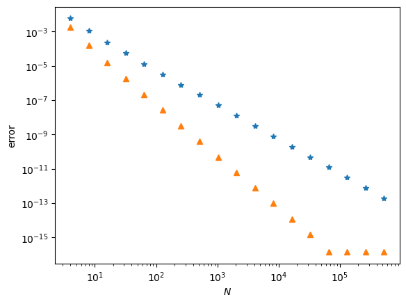
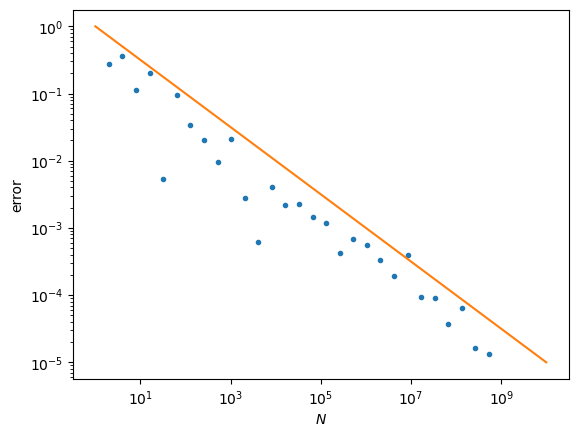

# 计算物理第二次作业

## 1 梯形和 Simpson 积分

```python
import numpy as np
import matplotlib.pyplot as plt


def integrand(x: float) -> float:
    """被积函数
    """
    return 4 / (1 + x**2)


def trapezoidal_integral(a: float, b: float, N: int) -> float:
    """梯形积分

    Args:
        a (float): 积分下限
        b (float): 积分上限
        N (int): 积分区间等分数

    Returns:
        float: 积分结果

    Example:
        >>> trapezoidal_integral(0, 1, 1000)
    """
    x = np.linspace(a, b, N)
    y = integrand(x)
    return (2*np.sum(y) - y[0] - y[-1]) * (b-a) / 2 / (N-1)


def simpson_integral(a: float, b: float, N: int) -> float:
    """Simpson 积分

    Args:
        a (float): 积分下限
        b (float): 积分上限
        N (int): 积分区间等分数

    Returns:
        float: 积分结果

    Example:
        >>> simpson_integral(0, 1, 1000)
    """

    x = np.linspace(a, b, N)
    y = integrand(x)

    weights = [2 + i % 2*2 for i in range(N)]  # 权重
    if N % 2 == 1:
        weights[0] = weights[-1] = 1  # 当 N 为奇数时权重为[1,4,2,4,....2,4,1]
    else:
        weights[0] = 1
        weights[-2] = 5/2
        weights[-1] = 3/2  # 当 N 为偶数时组后多出来的一小段用梯形积分补上

    return np.dot(y, weights) * (b-a) / 3 / (N-1)
```

比较两种方法的误差

```python
err_t = []  # 梯形积分误差
err_s = []  # Simpson 积分误差

Ns = [2**i for i in range(2,20,1)]
for N in Ns:
    I_t = trapezoidal_integral(a=0, b=1, N=N)
    err_t.append(abs(I_t - np.pi) / np.pi)
    
    I_s = simpson_integral(a=0, b=1, N=N)
    err_s.append(abs(I_s - np.pi) / np.pi)

plt.plot(Ns, err_t, '*')
plt.plot(Ns, err_s, '^')
plt.xlabel(f'$N$')
plt.ylabel('error')
plt.yscale('log')
plt.xscale('log')
```



当 $N$ 非常大后, Simpson 积分的精度超过了自带的 $\pi$ 的值, 所以后面的误差几乎变成了直线 (黄色三角形).

## Monte Carlo 计算 $\pi$

计算 $\pi$ 的程序

```python
import numpy as np


def MC_pi(N):
    point_xs = np.random.uniform(-1, 1, N)    #x坐标
    point_ys = np.random.uniform(-1, 1, N)    #y坐标

    R2s = point_xs**2 + point_ys**2           #x和y的平方和

    I_N = 4/N * np.sum(R2s < 1)
    return I_N
```

误差随 $N$ 的关系代码

```python
import matplotlib.pyplot as plt

err = []
Ns = [2**i for i in range(1,30,1)]
for N in Ns:
    pi = MC_pi(N)
    err.append(abs(pi - np.pi)/np.pi)

plt.plot(Ns, err, '.')
plt.xlabel(f'$N$')
plt.ylabel('error')
plt.yscale('log')
plt.xscale('log')

plt.plot([1, 1e10], [1, 1e-5])  # y = 1/sqrt(x) 参考线
plt.show()
```

结果如图所示, 黄色直线是 $y=1/\sqrt{x}$


