# 计算物理期末作业

## 更新电场和磁场

根据下图交替更新电场和磁场, 因为 `Python` 里的稀疏矩阵没有四阶张量, 而且最后也没有搞定这四个四阶张量的对角化, 所以只做了直接把这 $H^{(x)}$ 和 $H^{(y)}$ 交替作用了上去

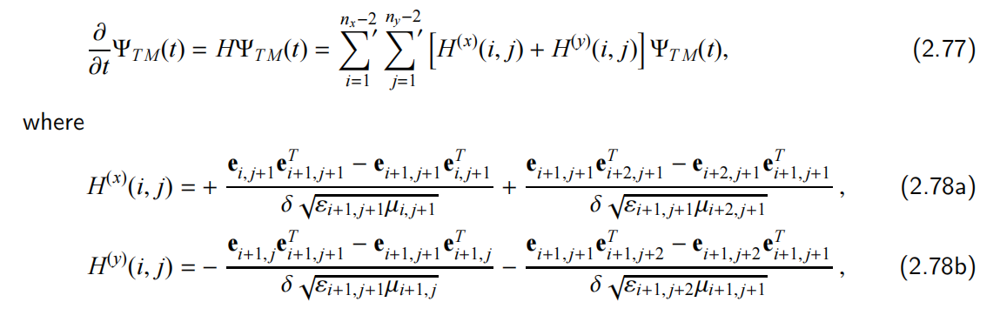

```python
from matplotlib import pyplot as plt
import numpy as np
# 更新 H
def update_H(Psi, dt):
    i_forward_Psi = np.zeros_like(Psi)
    i_forward_Psi[1:] = Psi[:-1]
    i_backward_Psi = np.zeros_like(Psi)
    i_backward_Psi[:-1] = Psi[1:]
    j_forward_Psi = np.zeros_like(Psi)
    j_forward_Psi[:,1:] = Psi[:,:-1]
    j_backward_Psi = np.zeros_like(Psi)
    j_backward_Psi[:,:-1] = Psi[:,1:]
    Psi[1::2,::2] += -dt * (j_backward_Psi - j_forward_Psi)[1::2,::2] / dx  #H_x
    Psi[::2,1::2] +=  dt * (i_backward_Psi - i_forward_Psi)[::2,1::2] / dy  #H_y
    Psi[1,::2] = Psi[-2,::2] = Psi[::2,1] = Psi[::2,-2] = 0

# 更新 E
def update_E(Psi, dt):
    i_forward_Psi = np.zeros_like(Psi)
    i_forward_Psi[1:] = Psi[:-1]
    i_backward_Psi = np.zeros_like(Psi)
    i_backward_Psi[:-1] = Psi[1:]
    j_forward_Psi = np.zeros_like(Psi)
    j_forward_Psi[:,1:] = Psi[:,:-1]
    j_backward_Psi = np.zeros_like(Psi)
    j_backward_Psi[:,:-1] = Psi[:,1:]
    Psi[1::2,1::2] += dt * (i_backward_Psi - i_forward_Psi)[1::2,1::2] / dx - dt * (j_backward_Psi - j_forward_Psi)[1::2,1::2] /dy #E_z
    Psi[1,::2] = Psi[-2,::2] = Psi[::2,1] = Psi[::2,-2] = 0
```

## 生成波包

初始波包由下面的公式表示:

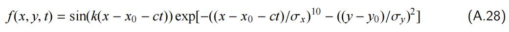

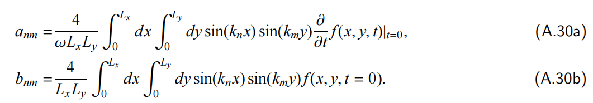

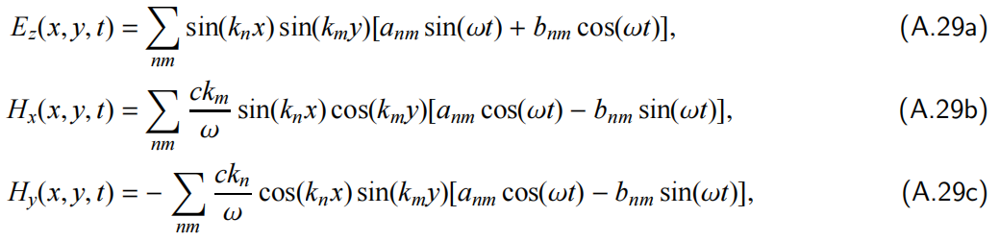

波包参数

```python
# 初始波包设置, 与 PDF 中一致
Lx = 18
Ly = 12
dx = 0.1
dy = 0.1
x0 = 3.05
y0 = 6.0
c = 1
sigmax = 2.75
sigmay = 2.0
k = 5

# 生成格点
x_even = np.arange(dx/2, Lx, dx)
y_even = np.arange(dy/2, Ly, dy)
x_odd = np.arange(0, Lx+dx, dx)
y_odd = np.arange(0, Ly+dy, dy)
X_mn, Y_mn = np.meshgrid(x_odd, y_odd, indexing='ij')
X_Ez, Y_Ez = np.meshgrid(x_even, y_even, indexing='ij')
X_Hx, Y_Hx = np.meshgrid(x_even, y_odd, indexing='ij')
X_Hy, Y_Hy = np.meshgrid(x_odd, y_even, indexing='ij')
n = np.arange(1,51,1)
m = np.arange(1,51,1)
N, M = np.meshgrid(n,m, indexing='ij')

nx = int(Lx/dx)*2 + 1  # x 方向格点数
ny = int(Ly/dy)*2 + 1  # y 方向格点数
omega = c*np.sqrt((N*np.pi/Lx)**2+(M*np.pi/Ly)**2)
```

计算波包的电磁场

```python
def f(x,y,t):  # 初始波包
    return np.sin(k*(x-x0-t))*np.exp(-((x-x0-t)/sigmax)**10-((y-y0)/sigmay)**2)
def get_anm(n,m):  # a_nm
    return np.sum(np.sin(n*np.pi/Lx*X_mn)*np.sin(m*np.pi/Ly*Y_mn)*((f(X_mn,Y_mn,0.0000001)-f(X_mn,Y_mn,0))/0.0000001)) * 4/(np.sqrt((n*np.pi/Lx)**2+(m*np.pi/Ly)**2)*Lx*Ly)
def get_bnm(n,m): # b_nm
    return np.sum(np.sin(n*np.pi/Lx*X_mn)*np.sin(m*np.pi/Ly*Y_mn)*f(X_mn,Y_mn,0)) * 4/(Lx*Ly)
def get_Ez(x,y,t): # 电场 z 分量
    return np.sum(np.sin(N*np.pi/Lx*x)*np.sin(M*np.pi/Ly*y)*(anm*np.sin(omega*t)+bnm*np.cos(omega*t)))
def get_Hx(x,y,t): # 磁场 x 分量
    return np.sum(c*M*np.pi/Ly/omega*np.sin(N*np.pi/Lx*x)*np.cos(M*np.pi/Ly*y)*(anm*np.cos(omega*t)-bnm*np.sin(omega*t)))
def get_Hy(x,y,t): # 磁场 y 分量
    return np.sum(-c*N*np.pi/Lx/omega*np.cos(N*np.pi/Lx*x)*np.sin(M*np.pi/Ly*y)*(anm*np.cos(omega*t)-bnm*np.sin(omega*t)))

# 向量化
v_anm = np.vectorize(get_anm)
v_bnm = np.vectorize(get_bnm)
v_Ez = np.vectorize(get_Ez)
v_Hx = np.vectorize(get_Hx)
v_Hy = np.vectorize(get_Hy)
```

```python
# 计算 a_nm, b_nm
anm = v_anm(N, M)
bnm = v_bnm(N, M)

# 制备初态电磁场
Ez_init = v_Ez(X_Ez,Y_Ez,t=0)
Hx_init = v_Hx(X_Hx,Y_Hx,t=0)
Hy_init = v_Hy(X_Hy,Y_Hy,t=0)

# 制备末态电磁场
Ez_final = v_Ez(X_Ez,Y_Ez,t=10)
Hx_final = v_Hx(X_Hx,Y_Hx,t=10)
Hy_final = v_Hy(X_Hy,Y_Hy,t=10)
```

PDF 中波包在 $t=0$ 和 $t=10$ 时刻是:

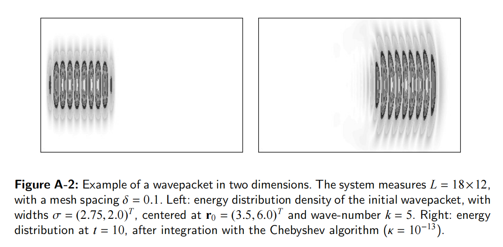

绘制计算出的波包

```python
# 画初始波包
fig = plt.figure(figsize=(15,4))
axes = fig.subplots(1, 3)
axes[0].imshow(Ez_init.T, cmap='bwr', origin='lower', extent=[0, 18, 0, 12])
axes[1].imshow(Hx_init.T, cmap='bwr', origin='lower', extent=[0, 18, 0, 12])
axes[2].imshow(Hy_init.T, cmap='bwr', origin='lower', extent=[0, 18, 0, 12])
axes[0].set_title('Ez')
axes[1].set_title('Hx')
axes[2].set_title('Hy')
fig.suptitle('t=0')
```

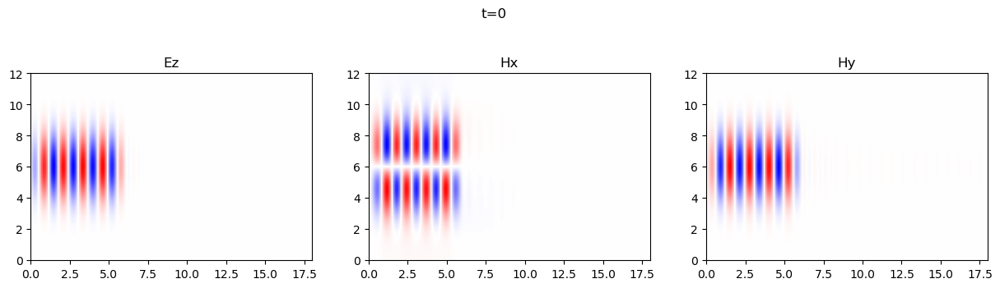

```python
# 画 t=10 时刻的波包
fig = plt.figure(figsize=(15,4))
axes = fig.subplots(1, 3)
axes[0].imshow(Ez_final.T, cmap='bwr', origin='lower', extent=[0, 18, 0, 12])
axes[1].imshow(Hx_final.T, cmap='bwr', origin='lower', extent=[0, 18, 0, 12])
axes[2].imshow(Hy_final.T, cmap='bwr', origin='lower', extent=[0, 18, 0, 12])
axes[0].set_title('Ez')
axes[1].set_title('Hx')
axes[2].set_title('Hy')
fig.suptitle('t=10')
```

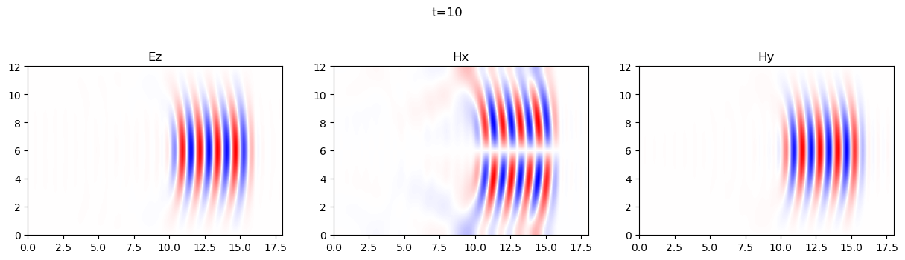

## 波包的演化

按 TM-Mode 的格点排列方式把 $E_z$, $H_x$ 和 $H_y$ 置入 $\Psi$ 中

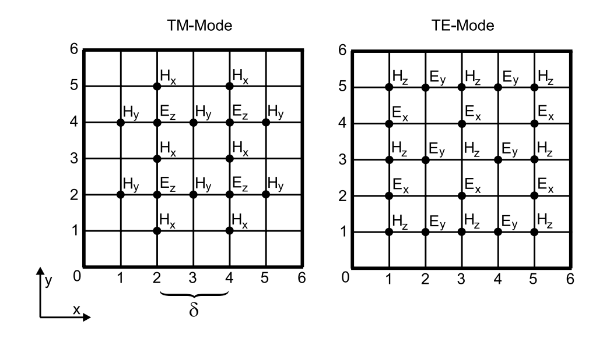

```python
# 用把 E 和 H 填入 Psi
Psi = np.zeros((nx, ny))
Psi[1::2,1::2] = Ez_init  # 偶数项是 E_z
Psi[1::2,::2] = Hx_init  # i 偶 j 奇是 H_x
Psi[::2,1::2] = Hy_init  # i 奇 j 偶是 H_y
```

将 `update_H` 和 `update_E` 两个函数交替作用在 $\Psi$ 上, 然后绘图

```python
dt = 0.01
Psi_odd = np.copy(Psi)
fig = plt.figure(figsize=(15,4))
axes = fig.subplots(1, 3)
for n_frame in range(100):  # 生成 100 张图像
    for i in range(20):     # 每张时间间隔 dt*20 = 0.2
        update_H(Psi, dt)
        update_E(Psi, dt)

    axes[0].imshow(Psi[1::2, 1::2].T, cmap='bwr', origin='lower', extent=[0, 18, 0, 12], vmin=-120, vmax=120)
    axes[1].imshow(Psi[1::2,::2].T, cmap='bwr', origin='lower', extent=[0, 18, 0, 12], vmin=-10, vmax=10)
    axes[2].imshow(Psi[::2,1::2].T, cmap='bwr', origin='lower', extent=[0, 18, 0, 12], vmin=-120, vmax=120)
    axes[0].set_title('Ez')
    axes[1].set_title('Hx')
    axes[2].set_title('Hy')
    fig.suptitle('t=%.1f'%(0.2*(n_frame+1)))
    fig.savefig(fname='./picture/t=%.1f.png'%(0.2*(n_frame+1)))
```

```python
# 输出成 mp4
from moviepy.editor import ImageSequenceClip
frame_rate = 24  # Frames per second
image_files = ['./picture/t=%.1f.png'%(0.2*(n_frame+1)) for n_frame in range(100)]
clip = ImageSequenceClip(image_files, fps=frame_rate)
clip.write_videofile('output.mp4')
```

最后结果输出为一系列时刻的 `png` 图片, 使用 `ffmpeg` 合成为 `mp4`, 并转换为 `gif`

其中一些时刻的电磁场:

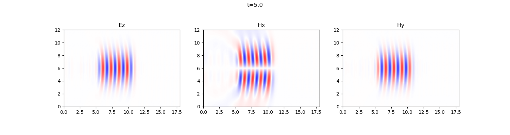

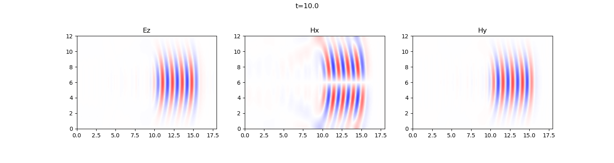

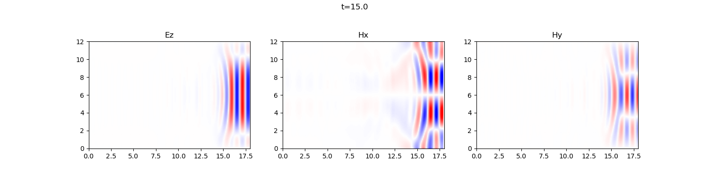

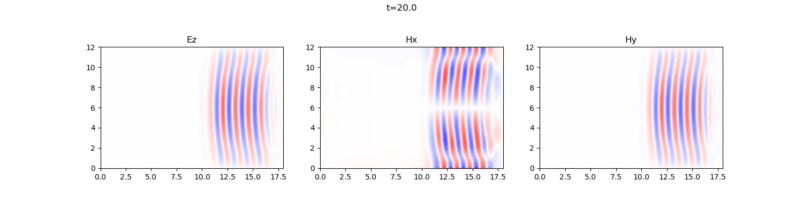

电磁场的 GIF:

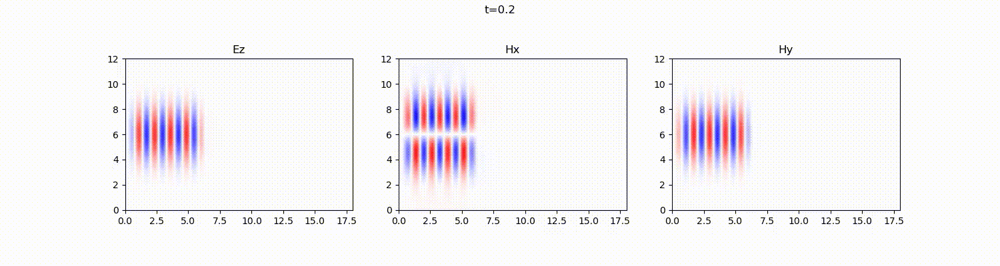
