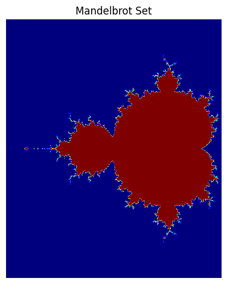
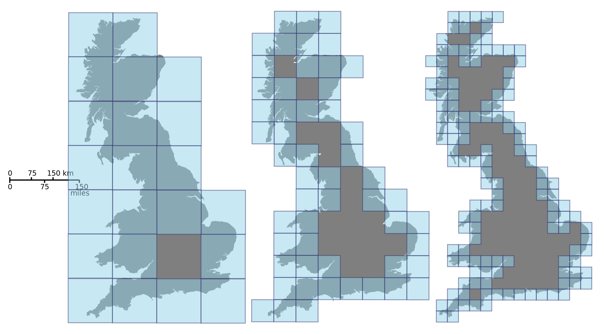
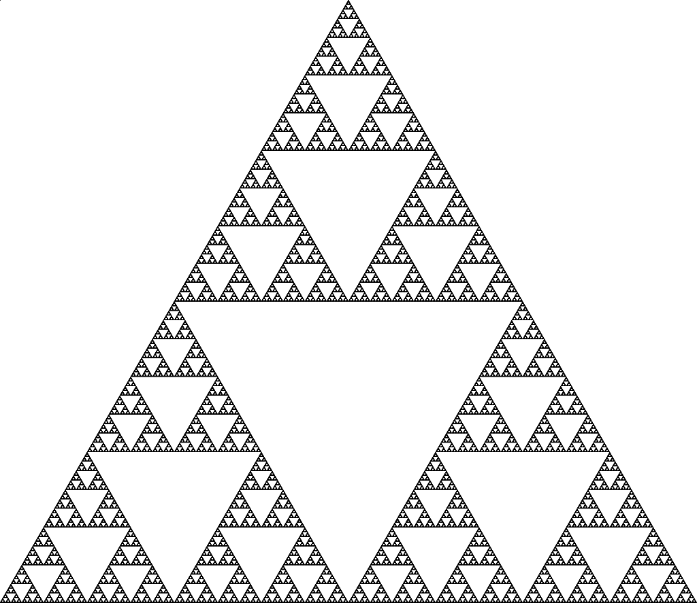
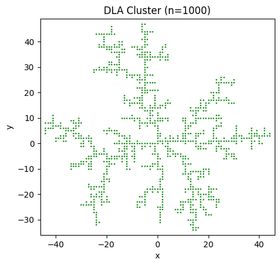
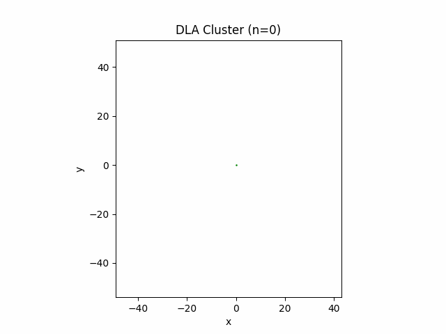

# 计算物理第十次作业

> 2020302191422 祝茗

## 绘制二维分形图像，并按照图7.23的方式计算分型维度

### 分形的概念

> **Fractals** are infinitely repeating patterns on different scales. While philosophers have argued for centuries about the existence of infinity, fractals do have an analogy in the real world.
>
> It’s a fairly common phenomenon occurring in nature. For example, this Romanesco cauliflower is finite but has a self-similar structure because each part of the vegetable looks like the whole, only smaller:
> 

分形 (Fractal) 和物体的自相似性有很大联系。

### 分形的例子

#### 康托集

数学里的分形可以说是从**康托尔集** (Cantor Set) 开始的。取一个线段，把它中间的 $1/3$ 去掉，可得两个分开的线段，再对得到的两个线段进行相同的操作，得到 $4$ 个线段，这样重复进行下去直到无穷，最后得到的图形集合就是康托尔集。

这样我们就用一个看似简单的步骤得到了一个无限复杂的图形，而且它的**每一个细节放大之后都和整体看起来一样**。

#### 科克曲线 (Koch snowflake)

通常也可以称之为雪花曲线，因为总体看来它是一个雪花的形状。

- 它的细节就是本身形状的无数次复制，没有穷尽；
- 它的周长是无限大，面积却不可能超过六角星的外接圆；
- 它是一个无限复杂的封闭曲线，但绝不会和自己相交。

基于这些特性，著名数学家 Mandelbrot 联想到了一个困扰了人们很多年的问题：英国的海岸线究竟有多长？以此为题，他在科学杂志上发表了对这一问题的深入探讨，我们之所以测不准海岸线的长度，是因为海岸线就是一个天然的分形，你测量的尺子越精细，得到的长度就会越长，随着放大倍数的增大，海岸线呈现出来的细节也就越多。

#### Mandelbrot set

这个以数学家 Mandelbrot 名字命名的集合，在平面上绘制出来就是一个奇异的分型图案。

它集非常简单的产生公式和无限复杂的图像为一体，曾被人们誉为“上帝的指纹”。


> The Mandelbrot sequence is given by the following recursive formula:

$$
\begin{cases}
    z_0 = 0 \\
    z_{n+1} = z_n^2 + c
\end{cases}
$$

> 如果这个式子构成的数列是发散的，即最后趋近于无穷，那么这个点 $(x, y)$ 不在 Mandelbrot set 内；反之，如果这个数列是有边界的，那么这个点在 Mandelbrot set 内。

自己根据教程画了图：



### 分形的维度

皮亚诺曲线 (Peano Curve)：通过不断构造自相似的形状，最终用一维的曲线填满了二维的正方形空间。

分形的维度可以是**分数**。

- 长度为 $1$ 的线段，再把它的尺寸缩小成原来的 $\frac{1}{2}$，需要 $2$ 个新的线段才能组成原来的线段。
- 一个面积为 $1$ 的正方形，把它的尺寸（边长）缩小成原来的 $\frac{1}{2}$，需要 $4$ 个新的正方形才能组成原来的正方形。
- 一个体积为 $1$ 的正方体，把它的尺寸（边长）缩小成原来的 $\frac{1}{2}$，需要 $8$ 个新的正方体才能组成原来的正方体。

不难发现

$$
\begin{align*}
\log_{2} 2 = 1 & & \log_{2} 4 = 2 & & \log_{2} 8 = 3 \\
\end{align*}
$$

对应的正是线段、正方形、正方体的维度。

以经典的谢尔宾斯基三角形 (Sierpinski triangle) 为例，把它的尺寸（边长）缩小成原来的 $\frac{1}{2}$，那么要 $3$ 个新的三角形才能组成原来的三角形，所以谢尔宾斯基三角形的维度为 $\log_{2}3$

这种描述分形的维度方法是 **Hausdorff 维度**。

### 计算的分形维度

由于许多二维分形并没有明确的中心，且分形也不一定处在中心对称的位置，所以在计算分形维度的时候没有采用书上的计算 Hausdorff 维度的方法，而是采用了计盒维数，即 Minkowski-Bouligand dimension。



$$
\mathrm{dim}_{\mathrm{box}}(S):=\lim_{\varepsilon \to 0} \frac{\log N(\varepsilon)}{\log (1/\varepsilon)}
$$

```python
import imageio.v2 as iio
import numpy as np


def fractal_dimension(Z: np.ndarray, threshold=0.8) -> float:
    """
    Returns the Minkowski-Bouligand dimension, i.e., box-counting dimension of a 2D array.

    Input:
        `Z`: 2D array to be analysed.
        `threshold`: Cutoff for converting values in Z to 1 and 0.
    Returns:
        The estimated box counting dimension.
    """
    assert (len(Z.shape) == 2)  # Only for 2d image

    def boxcount(Z: np.ndarray, k) -> int:
        S = np.add.reduceat(np.add.reduceat(Z, np.arange(0, Z.shape[0], k), axis=0), np.arange(0, Z.shape[1], k), axis=1)
        # We count non-empty (0) and non-full boxes (k*k)
        return len(np.where((S > 0) & (S < k*k))[0])

    Z = (Z < threshold)  # Transform Z into a binary array

    p = min(Z.shape)                        # Minimal dimension of image
    n = int(np.floor(np.log(p)/np.log(2)))    # Greatest power of 2 less than or equal to p
    sizes = 2**np.arange(n, 1, -1)          # Build successive box sizes (from 2**n down to 2**1)

    counts = []  # Actual box counting with decreasing size
    for size in sizes:
        counts.append(boxcount(Z, size))

    coeffs = np.polyfit(np.log(sizes), np.log(counts), 1)  # Fit the successive log(sizes) with log (counts)
    return -coeffs[0]
```

实际上计盒维数与 Haussdorf 维度的计算区别不大，都是在最后通过拟合对数坐标中的一条曲线，取其斜率为维数。

理论上来说，有

$$
\mathrm{dim}_{\mathrm{Haus}} \le \mathrm{dim}_{\mathrm{lower box}} \le \mathrm{dim}_{\mathrm{upper box}}
$$

根据实际测试，谢尔宾斯基三角的分形维度为

```python
I = iio.imread("./pic/sierpinski.png", as_gray="True") / 255.0  # Import the image in greyscale
print("Minkowski-Bouligand dimension (computed): ", fractal_dimension(I))
print("Haussdorf dimension (theoretical):        ", (np.log(3)/np.log(2)))
```



```text
Minkowski-Bouligand dimension (computed):  1.5855963935652113
Haussdorf dimension (theoretical):         1.5849625007211563
```

可以看出分形维度是计算中，使用计盒维数计算的维度与数学上的 Haussdorf 维度区别不大，可以接受。

生成书中提得到的 DLA cluseter

```python
def DLA_cluster(n: int):
    # init
    global X, Y
    X = [0]
    Y = [0]
    exist_set = set([(0, 0)])
    possible_set = set([
        (1, 0),
        (0, 1),
        (-1, 0),
        (0, -1)
    ])

    # grow
    for i in range(n-1):
        # random init point
        direction = np.random.randint(4)  # choose area, 0: right, 1: up, 2: left, 3: down
        if direction == 0:
            random_x = np.random.randint(max(X)+1, max(X)+5)
            random_y = np.random.randint(min(Y)-5, max(Y)+5)
        elif direction == 1:
            random_x = np.random.randint(min(X)-5, max(X)+5)
            random_y = np.random.randint(max(Y)+1, max(Y)+5)
        elif direction == 2:
            random_x = np.random.randint(min(X)-5, min(X)-1)
            random_y = np.random.randint(min(Y)-5, max(Y)+5)
        else:
            random_x = np.random.randint(min(X)-5, max(X)+5)
            random_y = np.random.randint(min(Y)-5, min(Y)-1)

        # random walk
        while True:
            if (random_x, random_y) in possible_set:
                choice = (random_x, random_y)
                exist_set.add(choice)
                X.append(random_x)
                Y.append(random_y)

                possible_set.add((random_x+1, random_y))
                possible_set.add((random_x, random_y+1))
                possible_set.add((random_x-1, random_y))
                possible_set.add((random_x, random_y-1))
                possible_set = possible_set - exist_set
                break
            else:
                direction = np.random.random()
                if direction < 0.5:
                    random_x += np.random.choice([-1, 1])
                else:
                    random_y += np.random.choice([-1, 1])

            # if random walk out of range, walk along the edge
            if random_x > i+2:
                random_x = i+2
            if random_x < -i-2:
                random_x = -i-2
            if random_y > i+2:
                random_y = i+2
            if random_y < -i-2:
                random_y = -i-2
```

通过随机生成点的随机游走过程生长的 DLA cluster 呈现为明显的树枝状结构。



> 本来我在QQ群里说效率不够高，达不到1000个点，但是后来稍微改进了一下重写了代码，效率有提升，但还是比较慢。

以下是用 `matplotlib.animation.FuncAnimation`绘制的动态图，画图有点慢，所以虽然生成了 1000 个点，但是只画了 500 个点的 gif



pdf 估计是显示不了 gif

详见 [GitHub](https://github.com/Harry-Zhu-45/CP_works/tree/main/homework/homework10/homework10.md).

DLA cluster 的维度为

```text
Minkowski-Bouligand dimension (computed):  1.4469893169898411
```

比书上的结果稍微小一点，可能和生成 cluster 的代码或是生成 cluster 的大小有关。

---

还测了其他二维分形的维度


```python
I = iio.imread("./pic/sierpinski_carpet.png", as_gray="True") / 255.0  # Import the image in greyscale
print("Minkowski-Bouligand dimension (computed): ", fractal_dimension(I))
print("Haussdorf dimension (theoretical):        ", (np.log(8)/np.log(3)))
```

```text
Minkowski-Bouligand dimension (computed):  1.8498916452191487
Haussdorf dimension (theoretical):         1.892789260714372
```

效果还行。

## 参考内容

- [什么是分形 - (zhihu.com)](https://www.zhihu.com/question/265983000/answer/301235097)
- [mandelbrot-set-python - (realpython.com)](https://realpython.com/mandelbrot-set-python/)
- [代码挑战——曼德尔球绘制](https://www.bilibili.com/video/BV1r3411F7fv/)
- [List of fractals by Hausdorff dimension](https://ipfs.io/ipfs/QmXoypizjW3WknFiJnKLwHCnL72vedxjQkDDP1mXWo6uco/wiki/List_of_fractals_by_Hausdorff_dimension.html)
- [Hausdorff_dimension - (wikipedia.org)](https://en.wikipedia.org/wiki/Hausdorff_dimension)
- [Minkowski–Bouligand_dimension - (wikipedia.org)](https://en.wikipedia.org/wiki/Minkowski%E2%80%93Bouligand_dimension)
