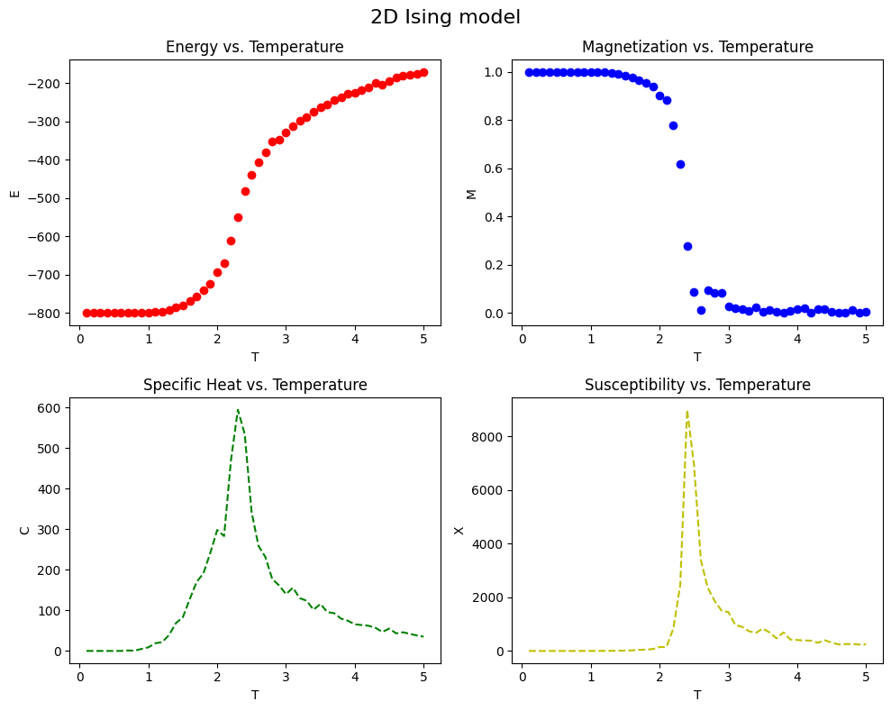
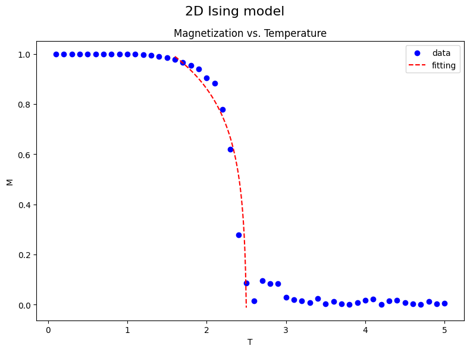
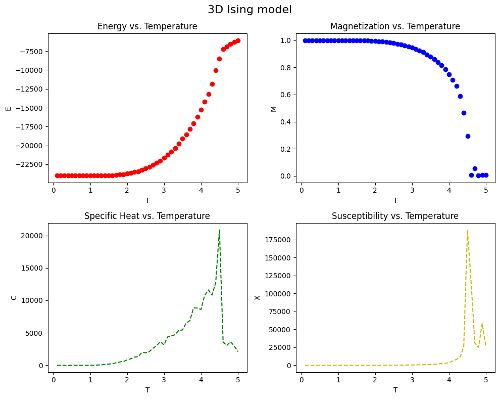
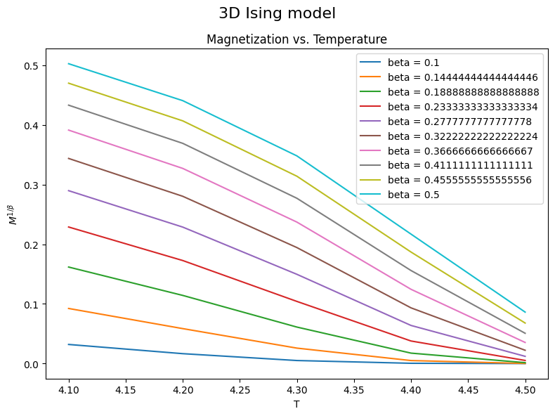

# 计算物理第十一次作业

> 2020302191422 祝茗

## 计算立方格子的性质

### 统计力学与 Ising model

磁性毫无疑问是一种量子性质。

当一群粒子的自旋方向指向同一个方向的时候，产生了一个宏观的磁矩，这就是铁磁性产生的本质。

为了简单起见，我们可以假设这些研究的粒子的位置是固定在晶格上的，不会改变。并且假设粒子的自旋只有上下两种状态，用 $s_i=\pm 1$ 表示。在铁磁体中，这种相互作用将有利于自旋对的平行排列。

考虑最简单的 Ising model——只考虑相邻粒子之间的相互作用。

$$
\begin{align}
E = -J \sum\limits_{\braket{ij}} s_i s_j
\end{align}
$$

其中 $J$ 是一个正的交换常数，下标 $\braket{ij}$ 表示对所有的相邻粒子的相互作用求和。

在没有磁场的情况下具有磁矩的系统被称为具有自发磁化。

研究正则系综，某一个微观态 $\alpha$ 出现的概率正比于 Boltzmann 因子。

$$
\begin{align}
P_\alpha \propto \mathrm{e}^{-E_\alpha/k_B T}
\end{align}
$$

根据概率，可以给出系统的总磁矩

$$
\begin{align}
M = \sum\limits_{\alpha} M_\alpha P_\alpha
\end{align}
$$

如果粒子自旋的朝向在二维平面内随机选取，称之为 XY model；如果粒子自旋的朝向在三维空间中随机选取，称之为 Heisenberg model。

### 平均场论 (MFT)

无限大系统中，每个粒子所处状态都是一致的，所以可认为所有粒子在统计意义上都具有相同的**平均的**性质。

所以系统的总磁矩可以写成

$$
\begin{align}
M = \sum\limits_{i} \braket{s_i} = N \braket{s_i}
\end{align}
$$

如果给系统外加一个磁场

$$
\begin{align}
E = -J \sum\limits_{\braket{ij}} s_i s_j - \mu H \sum\limits_{i} s_i
\end{align}
$$

外磁场的存在会使粒子自旋磁矩的取向平行于外磁场，因为这样可以使体系的能量降低。

对于单个粒子而言

$$
\begin{align}
s_i = \pm 1, & & E_\pm = \mp \mu H
\end{align}
$$

系统处于两种量子态的概率分别为

$$
\begin{align}
P_+ = C \mathrm{e}^{+\mu H/k_B T} \\
P_- = C \mathrm{e}^{-\mu H/k_B T}
\end{align}
$$

其中 $C$ 是归一化系数

$$
\begin{align}
C = \frac{1}{\mathrm{e}^{+\mu H/k_B T}+\mathrm{e}^{-\mu H/k_B T}}
\end{align}
$$

所以

$$
\begin{align}
\braket{s_i} = \sum\limits_{s_i=\pm 1} s_i P_\pm = P_+ - P_- = \tanh(\mu H/k_B T)
\end{align}
$$

平均场论假设，自旋 $s_i$ 与其相邻自旋的相互作用，等价于作用于 $s_i$ 的有效磁场。

所以体系的能量可以改写为

$$
\begin{align}
E = -\left(J \sum\limits_{\braket{ij}} s_j\right) s_i - \mu H s_i
\end{align}
$$

其中，粒子间的相互作用可以写成与外磁场对粒子作用的相似的形式。

平均场论所做的近似就是，把粒子间的相互作用等效于一个磁场 $H_{eff}$

$$
\begin{align}
H_{eff} = \frac{J}{\mu} \sum \braket{s} = \frac{z J}{\mu} \braket{s}
\end{align}
$$

其中 $z$ 表示与粒子 $s_i$ 相邻的粒子数。

结合之前推导的公式可得

$$
\begin{align}
\braket{s} = \tanh(z J \braket{s} / k_B T)
\end{align}
$$

MFT 预测在这种情况下 $T_C=4$ 温度的单位为 $(J/k_B)$

系统的总磁矩 $M$ 在 $T \to T_C$ 时，曲线的斜率 $\mathrm{d}M/\mathrm{d}T$ 变得很大。当 $x \to 0$ 时，可以取 $\tanh x \approx x-x^3/3$

因此

$$
\braket{s} = \sqrt{\frac{3}{T} \left(\frac{k_B T}{z J}\right)^3} \left(\frac{z J}{k_B T} - T\right)^{1/2} \sim (T_C - T)^\beta
$$

### Monte Carlo

可以使用蒙特卡洛方法来模拟这个过程。模拟过程中，初始化为随机的取向，计算过程中使用周期性边界条件。

```python
import numpy as np
import matplotlib.pyplot as plt
from matplotlib.animation import FuncAnimation


# 2D Ising model
def ising(J, h, T, N, M, n):
    """
    input:
        J: interaction energy
        h: magnetic field
        T: temperature
        N: number of spins
        M: number of Monte Carlo steps
        n: number of samples

    return:
        E_avg: average energy
        M_avg: average magnetization
        C: specific heat
        X: susceptibility initialize
    """
    # initialize
    spins = np.random.choice([-1, 1], size=(N, N))  # random spin initialization
    # spins = np.ones((N, N))                         # all spin up initialization

    E = -J * (np.sum(spins * np.roll(spins, 1, axis=0))     # interaction energy with up/down neighbors (periodic boundary condition)
              + np.sum(spins * np.roll(spins, 1, axis=1))   # interaction energy with left/right neighbors (periodic boundary condition)
              ) - h * np.sum(spins)  # external field energy

    E_list = np.zeros(M)
    M_list = np.zeros(M)

    # Monte Carlo
    for i in range(M):
        for j in range(N**2):
            # randomly choose a spin
            x = np.random.randint(0, N)
            y = np.random.randint(0, N)

            # calculate energy difference
            delta_E = J * 2*spins[x, y] * (spins[(x+1) % N, y] + spins[(x-1) % N, y] + spins[x, (y+1) % N] + spins[x, (y-1) % N]) + \
                h * 2*spins[x, y]  # mod N is periodic boundary condition, 2*spins[x, y] is the energy of the spin itself

            # Metropolis flip algorithm
            if delta_E < 0 or np.random.rand() < np.exp(-delta_E / T):
                spins[x, y] *= -1
                E += delta_E

        E_list[i] = E
        M_list[i] = np.sum(spins)

    # average
    E_avg = np.average(E_list[n:])
    M_avg = np.average(M_list[n:])
    C = np.var(E_list[n:]) / T**2
    X = np.var(M_list[n:]) / T
    return E_avg, M_avg, C, X


# 3D Ising model
def ising3D(J, h, T, N, M, n):
    """
    input:
        J: interaction energy
        h: magnetic field
        T: temperature
        N: number of spins
        M: number of Monte Carlo steps
        n: number of samples

    return:
        E_avg: average energy
        M_avg: average magnetization
        C: specific heat
        X: susceptibility initialize
    """
    # initialize
    spins = np.random.choice([-1, 1], size=(N, N, N))  # random spin initialization
    # spins = np.ones((N, N, N))                         # all spin up initialization

    E = -J * (np.sum(spins * np.roll(spins, 1, axis=0))     # interaction energy with up/down neighbors (periodic boundary condition)
              + np.sum(spins * np.roll(spins, 1, axis=1))   # interaction energy with left/right neighbors (periodic boundary condition)
              + np.sum(spins * np.roll(spins, 1, axis=2))   # interaction energy with front/back neighbors (periodic boundary condition)
              ) - h * np.sum(spins)  # external field energy

    E_list = np.zeros(M)
    M_list = np.zeros(M)

    # Monte Carlo
    for i in range(M):
        for j in range(N**3):
            # randomly choose a spin
            x = np.random.randint(0, N)
            y = np.random.randint(0, N)
            z = np.random.randint(0, N)

            # calculate energy difference
            delta_E = J * 2*spins[x, y, z] * (spins[(x+1) % N, y, z] + spins[(x-1) % N, y, z] + spins[x, (y+1) % N, z] + spins[x, (y-1) % N, z] + spins[x, y, (z+1) % N] + spins[x, y, (z-1) % N]) + \
                h * 2*spins[x, y, z]  # mod N is periodic boundary condition, 2*spins[x, y, z] is the energy of the spin itself

            # Metropolis flip algorithm
            if delta_E < 0 or np.random.rand() < np.exp(-delta_E / T):
                spins[x, y, z] *= -1
                E += delta_E

        E_list[i] = E
        M_list[i] = np.sum(spins)

    # average
    E_avg = np.average(E_list[n:])
    M_avg = np.average(M_list[n:])
    C = np.var(E_list[n:]) / T**2
    X = np.var(M_list[n:]) / T
    return E_avg, M_avg, C, X
```

#### 2D Ising model

对于方格子上的 Ising model，精确的解析解给出的转变温度为

$$
T_C = 2 / \ln(1+\sqrt{2}) \approx 2.27
$$

蒙特卡洛方法模拟的结果为



可以看出与理论结果复合的较好。

尝试进行幂次的拟合

```python
# beta fitting
import scipy.optimize as opt


T_list = np.loadtxt('./data/2D_demo/T_list.txt')
M_list = np.loadtxt('./data/2D_demo/M_list.txt')


fig, ax = plt.subplots(figsize=(8, 6))
fig.suptitle('2D Ising model', fontsize=16)

ax.set_title('Magnetization vs. Temperature')
ax.set_xlabel('T')
ax.set_ylabel('M')
ax.scatter(T_list, np.abs(M_list) / N**2, c='b', label='data')

begin = 15
end = 25
T_list = T_list[begin:end]
M_list = abs(M_list[begin:end]) / N**2
# Tc = 2 / np.log(1 + np.sqrt(2))
Tc = T_list[-1] + 0.01


# fitting function
def func(x, a, b):
    return a + b * np.log(Tc - x)


a, b = opt.curve_fit(func, T_list, M_list)[0]

print('beta = ', b)

Tdata = np.linspace(T_list[0], T_list[-1], 100)
ax.plot(Tdata, func(Tdata, a, b), 'r--', label='fitting')
ax.legend()

plt.tight_layout()
plt.show()
```

在转变温度附近的拟合的结果为



```text
beta =  0.22212884046772816
```

幂次的拟合结果与理论值 $0.31$ 相差比较大，可能是由于取点比较稀疏，也有可能是因为模拟的次数不足，没有消除统计误差。

#### 3D Ising model

作业是模拟立方格子的 Ising model，根据在网上搜索的资料，立方格子的 Ising model 的转变温度 $T_C \approx 4.512$

模拟的结果为



课本给出了两种拟合数据的方法，这里使用第一种

```python
# beta fitting
import scipy.optimize as opt


T_list = np.loadtxt('./data/3D_demo/T_list3D.txt')
M_list = np.loadtxt('./data/3D_demo/M_list3D.txt')


fig, ax = plt.subplots(figsize=(8, 6))
fig.suptitle('3D Ising model', fontsize=16)

ax.set_title('Magnetization vs. Temperature')
ax.set_xlabel('T')
ax.set_ylabel('$M^{1/\\beta}$')

begin = 40
end = 45
T_list = T_list[begin:end]
M_list = abs(M_list[begin:end]) / N**3

for beta in np.linspace(0.1, 0.5, 10):
    ax.plot(T_list, M_list ** (1/beta), label='beta = ' + str(beta))

ax.legend()

plt.tight_layout()
plt.show()
```

拟合的结果为



可以看出淡紫色与棕色之间，拟合曲线近似为直线，根据书上的拟合方法可得，$\beta$ 介于 $0.27$ 与 $0.32$ 之间，与参考值 $0.31$ 较为接近。
