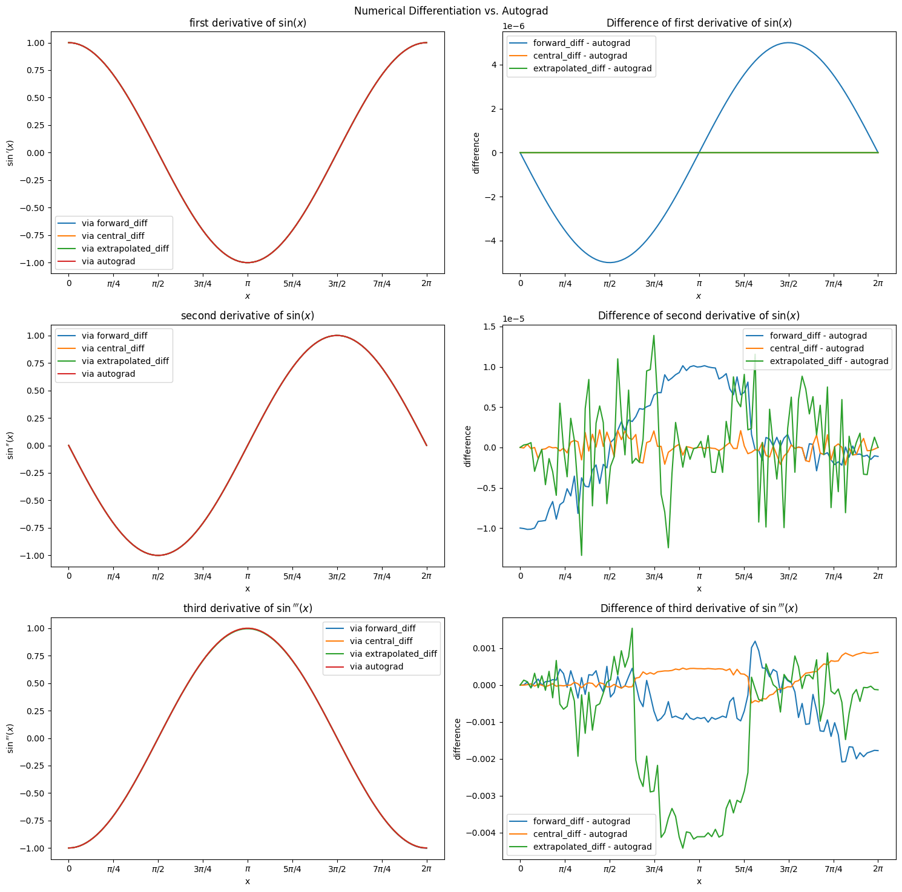
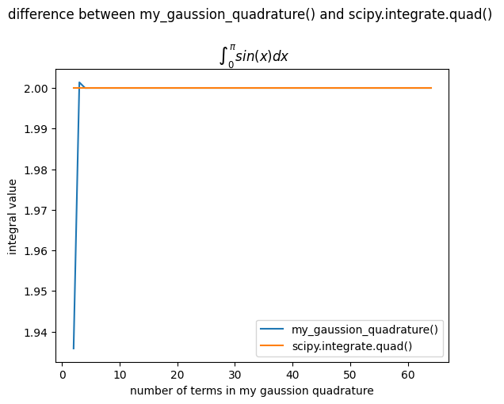
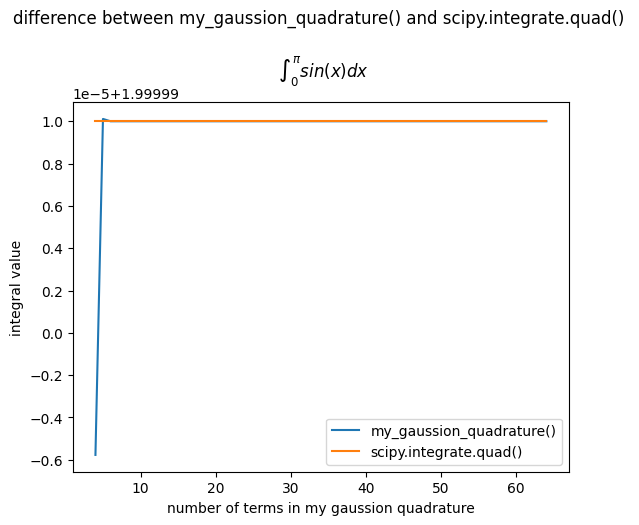
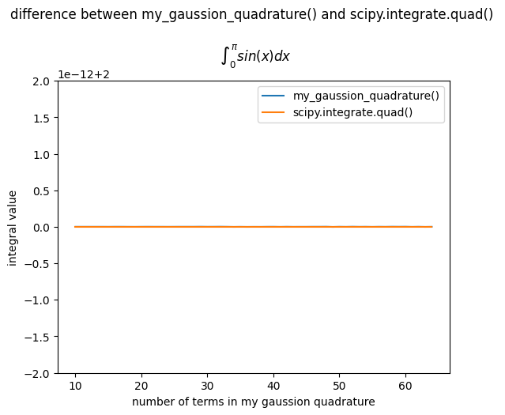
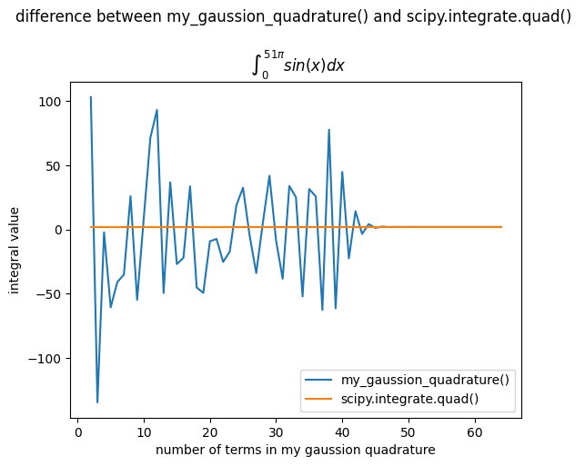
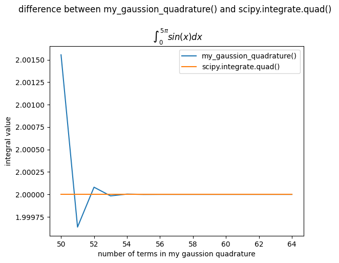

# 计算物理第五次作业

> 2020302191422 祝茗

## 利用`Forward Difference`, `Central Difference`, `Extrapolated Difference`计算$sin(x)$在$[0, 2\pi]$范围内的1阶导数，2阶导数和3阶导数，并比较与精确结果（autograd包）的差异

### 函数定义部分

```python
from autograd import grad
import autograd.numpy as anp


# first derivative
def forward_diff(func, x, h=0.00001):
    return (func(x+h)-func(x)) / h


def central_diff(func, x, h=0.00001):
    return (func(x+h/2)-func(x-h/2)) / h


def extrapolated_diff(func, x, h=0.00001):
    return (4*central_diff(func, x, h/2)-central_diff(func, x, h)) / 3


# second derivative
def forward_diff_2(func, x, h=0.00001):
    return (func(x+2*h) + func(x) - 2*func(x+h)) / (h*h)


def central_diff_2(func, x, h=0.00001):
    return (func(x+h) + func(x-h) - 2*func(x)) / (h*h)


def extrapolated_diff_2(func, x, h=0.00001):
    return (4*central_diff_2(func, x, h/2)-central_diff_2(func, x, h)) / 3


# third derivative
def forward_diff_3(func, x, h=0.00001):
    return (func(x+3*h) + 3*func(x+h) - (func(x) + 3*func(x+2*h))) / (h*h*h)


def central_diff_3(func, x, h=0.00001):
    return (func(x+2*h) - 2*func(x+h) + 2*func(x-h) - func(x-2*h)) / (2*h*h*h)


def extrapolated_diff_3(func, x, h=0.00001):
    return (8*central_diff_3(func, x, h/2)-central_diff_3(func, x, h)) / 7


# autograd method
grad_sin = grad(anp.sin)
grad_grad_sin = grad(grad_sin)
grad_grad_grad_sin = grad(grad_grad_sin)
```

### 计算导数、比较差异、绘图展示

```python
import numpy as np
import matplotlib.pyplot as plt


fig, [[ax1, ax2], [ax3, ax4], [ax5, ax6]] = plt.subplots(3, 2, figsize=(15, 15))
fig.suptitle('Numerical Differentiation vs. Autograd')

xdata = np.linspace(0, 2*np.pi, 100)
xticks = np.linspace(0, 2*np.pi, 9)
xname = ['0', '$\pi/4$', '$\pi/2$', '$3\pi/4$', '$\pi$', '$5\pi/4$', '$3\pi/2$', '$7\pi/4$', '$2\pi$']

# first derivative of sin(x)
# fig1: compare the three methods with autograd
ax1.set_title('first derivative of $\sin(x)$')
ax1.set_xlabel('$x$')
ax1.set_xticks(xticks, xname)
ax1.set_ylabel('$\sin\'(x)$')

current_h = 0.00001
y1 = [forward_diff(anp.sin, x, current_h) for x in xdata]
y2 = [central_diff(anp.sin, x, current_h) for x in xdata]
y3 = [extrapolated_diff(anp.sin, x, current_h) for x in xdata]
y4 = [grad_sin(x) for x in xdata]

ax1.plot(xdata, y1, label='via forward_diff')
ax1.plot(xdata, y2, label='via central_diff')
ax1.plot(xdata, y3, label='via extrapolated_diff')
ax1.plot(xdata, y4, label='via autograd')

ax1.legend(loc='best')


# fig2: show the difference between the three methods and autograd
ax2.set_title('Difference of first derivative of $\sin(x)$')
ax2.set_xlabel('$x$')
ax2.set_xticks(xticks, xname)
ax2.set_ylabel('difference')
# ax2.set_yscale('log')

diff1 = [i-j for i, j in zip(y1, y4)]
diff2 = [i-j for i, j in zip(y2, y4)]
diff3 = [i-j for i, j in zip(y3, y4)]

ax2.plot(xdata, diff1, label='forward_diff - autograd')
ax2.plot(xdata, diff2, label='central_diff - autograd')
ax2.plot(xdata, diff3, label='extrapolated_diff - autograd')

ax2.legend(loc='best')


# second derivative of sin(x)
# fig3: compare the three methods with autograd
ax3.set_title('second derivative of $\sin(x)$')
ax3.set_xlabel('x')
ax3.set_xticks(xticks, xname)
ax3.set_ylabel('$\sin\'\'(x)$')

current_h = 0.00001
y1 = [forward_diff_2(anp.sin, x, current_h) for x in xdata]
y2 = [central_diff_2(anp.sin, x, current_h) for x in xdata]
y3 = [extrapolated_diff_2(anp.sin, x, current_h) for x in xdata]
y4 = [grad_grad_sin(x) for x in xdata]

ax3.plot(xdata, y1, label='via forward_diff')
ax3.plot(xdata, y2, label='via central_diff')
ax3.plot(xdata, y3, label='via extrapolated_diff')
ax3.plot(xdata, y4, label='via autograd')

ax3.legend(loc='best')


# fig4: show the difference between the three methods and autograd
ax4.set_title('Difference of second derivative of $\sin(x)$')
ax4.set_xlabel('x')
ax4.set_xticks(xticks, xname)
ax4.set_ylabel('difference')
# ax4.set_yscale('log')

diff1 = [i-j for i, j in zip(y1, y4)]
diff2 = [i-j for i, j in zip(y2, y4)]
diff3 = [i-j for i, j in zip(y3, y4)]

ax4.plot(xdata, diff1, label='forward_diff - autograd')
ax4.plot(xdata, diff2, label='central_diff - autograd')
ax4.plot(xdata, diff3, label='extrapolated_diff - autograd')

ax4.legend(loc='best')


# third derivative of sin(x)
# fig5: compare the three methods with autograd
ax5.set_title('third derivative of $\sin\'\'\'(x)$')
ax5.set_xlabel('x')
ax5.set_xticks(xticks, xname)
ax5.set_ylabel('$\sin\'\'\'(x)$')

current_h = 0.0001
y1 = [forward_diff_3(anp.sin, x, current_h) for x in xdata]
y2 = [central_diff_3(anp.sin, x, current_h) for x in xdata]
y3 = [extrapolated_diff_3(anp.sin, x, current_h) for x in xdata]
y4 = [grad_grad_grad_sin(x) for x in xdata]

ax5.plot(xdata, y1, label='via forward_diff')
ax5.plot(xdata, y2, label='via central_diff')
ax5.plot(xdata, y3, label='via extrapolated_diff')
ax5.plot(xdata, y4, label='via autograd')

ax5.legend(loc='best')


# fig6: show the difference between the three methods and autograd
ax6.set_title('Difference of third derivative of $\sin\'\'\'(x)$')
ax6.set_xlabel('x')
ax6.set_xticks(xticks, xname)
ax6.set_ylabel('difference')
# ax6.set_yscale('log')

diff1 = [i-j for i, j in zip(y1, y4)]
diff2 = [i-j for i, j in zip(y2, y4)]
diff3 = [i-j for i, j in zip(y3, y4)]

ax6.plot(xdata, diff1, label='forward_diff - autograd')
ax6.plot(xdata, diff2, label='central_diff - autograd')
ax6.plot(xdata, diff3, label='extrapolated_diff - autograd')

ax6.legend(loc='best')


plt.tight_layout()  # adjust the layout
plt.show()
```



> 一阶导数在h=0.00001时，三种数值微分方法与autograd的结果相差不大，可以达到$10^{-6}$的精度。

向前微分的误差为：

$$
\begin{split}
\frac{dy(t)}{dt} &= \left.\frac{dy(t)}{dt}\right|_{fd} + \frac{h}{2}\frac{d^2y(t)}{dt^2} + \cdots \\
\left.\frac{dy(t)}{dt}\right|_{fd} - \frac{dy(t)}{dt} &= -\frac{h}{2}\frac{d^2y(t)}{dt^2} - \cdots \\
\left.\frac{dy(t)}{dt}\right|_{fd} - \frac{dy(t)}{dt} &\approx -\frac{h}{2}\frac{d^2y(t)}{dt^2} \\
\end{split}
$$

> 对于函数sin(x)，向前微分的误差为与理论相符

---

> 二阶导数在h=0.00001时，三种数值微分方法与autograd的结果相差不大，可以达到$10^{-5}$的精度。

---

> 三阶导数在h=0.00001时，三种数值微分方法与autograd的结果差距开始显现，可以达到$10^{-3}$的精度。

## 阅读书上5.12节，利用高斯-勒让德积分方法计算自选函数的积分

### 高斯-勒让德积分方法

- [高斯-勒让德积分方法](https://en.wikipedia.org/wiki/Gauss%E2%80%93Legendre_quadrature)

### 高斯求积方法的实现与比较

被积函数沿用了 $\sin(x)$

```python
import matplotlib.pyplot as plt
import numpy as np
import scipy.integrate


def integrand(x):
    return np.sin(x)


def my_gaussian_quadrature(a=0, b=np.pi, f=np.sin, n=64):
    # 使用 NumPy 生成勒让德多项式的根和权重
    x, w = np.polynomial.legendre.leggauss(n)
    # 线性映射到区间 [a, b]
    t = 0.5 * (b - a) * x + 0.5 * (a + b)
    return 0.5 * (b - a) * np.sum(w * f(t))


# 积分上限是 51π
a, b = 0, 51 * np.pi

my_integral_result = [my_gaussian_quadrature(a=a, b=b, f=integrand, n=i) for i in range(50, 65)]
scipy_integral_result = [scipy.integrate.quad(integrand, a, b)[0] for _ in range(50, 65)]

# plot
fig, ax = plt.subplots()
ax.set_title(
    r"Difference between my_gaussian_quadrature() and scipy.integrate.quad()"
    "\n\n $\int_0^{51\pi} \sin(x) \, dx$"
)
ax.set_xlabel("Number of terms (n)")
ax.set_ylabel("Integral value")

ax.plot(range(50, 65), my_integral_result, label="my_gaussian_quadrature()")
ax.plot(range(50, 65), scipy_integral_result, label="scipy.integrate.quad()", linestyle="--")

ax.legend(loc="best")
plt.show()
```

由于有关高斯积分法的选点与权重数据包含了 $n=2 \to 64$，所以尝试计算不同项数的区别。

以[scipy.integrate.quad()](https://docs.scipy.org/doc/scipy-1.8.1/reference/generated/scipy.integrate.quad.html)为基准，计算了高斯积分在不同项数下的误差。

> 在积分区间为(0,$\pi$)时，两者的区别较小



且积分的计算精度随着项数的增多，误差逐渐缩小



10项之后几乎没有区别，精度可达$10^{-12}$



> 在积分区间较大时，可以看出项数增大对精度有非线性的改善



50项后，精度可达$10^{-4}$以上


